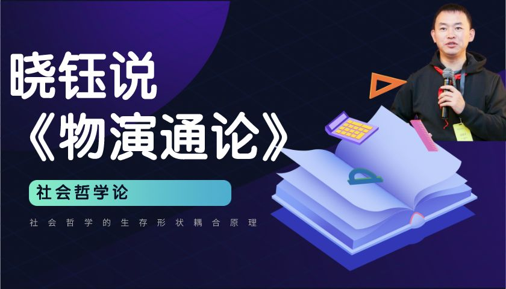
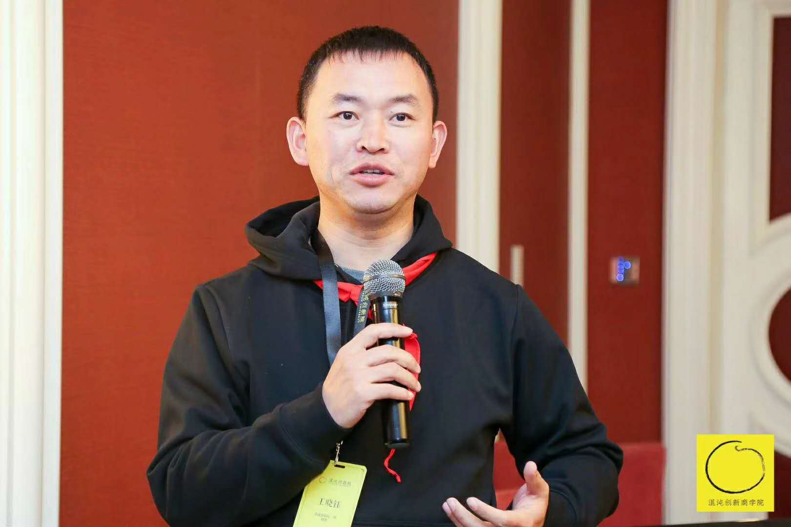

## 前言

以系统论重新构建物演通论，更加定量化描述递弱代偿原理，并建立计算机模型，引入最近二十年的新信息量，尤其是人工智能和大数据的新进展。

## 缘起

中国人很实际，只要方案不问过程，只问结果不问所以然。但是，任何复杂问题的解决都离不开深度思考。而最深的思考，莫过于哲学。

作为王东岳先生第八期的学生，我深受先生物演通论思想的影响。尤其是我从事的智能制造，使传统的工业面临全新的智能化转型。当所有人还都在探索的时候，如何分辨各种鱼龙混杂的观点？东岳先生的哲学思考，给了我极大的思想底蕴和工作上的定力。

东岳先生的思想，汇集在《物演通论》，然而《物演通论》作为一本哲学书，语言晦涩、理论抽象，吓住很多人，大多数人买了放在书架上，甚至都没能翻过3页。

我希望以现代化的语言来领读《物演通论》，同时以输出来拉动我的思考，系统地整顿一下近几年工作的感悟。输出是最好的学习方法，我相信经我整顿和表达过的知识，就真的内化为我自己的了。

## 关于作者：王晓钰

王晓钰，一个爱哲学、懂管理的技术男。

电力电子、工业控制、智能制造技术专家。

- **经验丰富的工程师**：从风力发电、人工智能，到智能制造，持续进化。

- **童心不泯的探索者**：融通科学技术与社会人文，探寻万事万物的共性。

2007年博士毕业于西安交通大学，曾在GE、远景能源、三一重工等知名企业主导过多款智能化产品开发。现在从事智能制造及传统工业的数字化转型研究。

> 因王东岳老师渐入哲学思境，希望通过入世的企业实践与出世的终极追问，探索第四次工业革命之际，新旧文明更新的形态和底层认知。

长按二维码关注我的个人微信公众号：王晓钰

思想探索的过程，非常孤独。任何的反馈，都能帮助我改进。

欢迎你跟我直接交流，加我个人微信：xywang_

