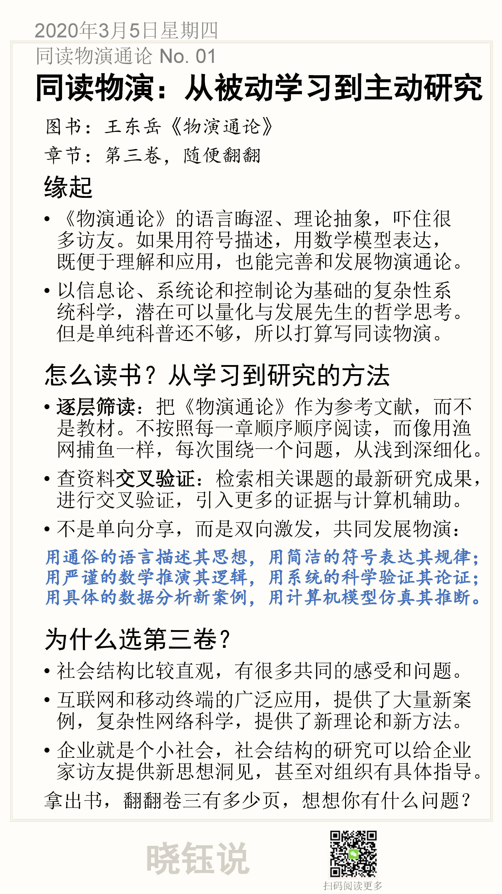

# 01. 从被动学习到主动研究

> 前面《同读控制论》已经写了十几篇了，虽然控制论深深影响了我，成了我思维的基本方法论之一，但是控制论的概念和思想对多数人比较陌生。所以我打算开启以物演通论为底色的哲学系列：晓钰说物演，领读王东岳的《物演通论》。

章节：第三卷，第121章至180章
主题：社会哲学的生存性状耦合原理

[TOC]

## 《物演通论》为什么难读？

首先，这是一本学术著作，用哲学语言力求精准和严谨，而忽视易读性。如果能用符号描述，用数学模型表达，既便于理解和应用，也能完善和发展物演通论。

其次，写书也是坐着整顿思绪的过程，整顿中思想不免有诞生、成行中的凌乱痕迹。现在可以更条理化地梳理，站在便于读者理解的角度来重整，比如绘制一些表格、图表，让读者更好地把握逻辑思路。

另外，《物演通论》成书之后，互联网尤其是移动互联网的广泛应用，提供了大量的新信息，以网络科学为代表的复杂性科学，提供了新的研究方法，可以更好整顿物演通论的理论。先生推演的时候，无法带入参数的一些规律，也许可以带入参数。我认为，以信息论、系统论和控制论为基础的复杂性系统科学，潜在可以量化与发展先生的哲学思考。但是单纯科普还不够，所以打算写同读物演。

## 怎么读《物演通论》？

首先，做好心理准备。不是按照读畅销书的方法，而应该按照学术研究的方法，反而更容易把握住脉络。

“开智部落”介绍了学术著作的阅读，有两种方法：

- **抽样阅读**：保持好奇心，像探寻宝藏一样在书中搜索有价值的观点，搜索反常识和有独特贡献的知识点
- **结构化阅读**：检索该领域的相关资料，对照研究

对应地，我以这样的方法来领读《物演通论》：

- **逐层筛读**：把《物演通论》作为参考文献，而不是教材。不按照每一章顺序顺序阅读，而像用渔网捕鱼一样，每次围绕一个问题，从浅到深细化。
- 查资料**交叉验证**：检索相关课题的最新研究成果，进行交叉验证，引入更多的证据与计算机辅助。

## 不小的目标

我不是单向分享，而是双向激发。希望大家多与我互动，可以共同发展物演。最终希望能：

**用通俗的语言描述其思想，**
**用简洁的符号表达其规律；**
**用严谨的数学推演其逻辑，**
**用系统的科学验证其论证；**
**用具体的数据分析新案例，**
**用计算机模型仿真其推断。**

能做到这些，实际上是将物演通论的哲学科学化了，一旦有了形式化的表述，我们就不必琢磨自然语言勉强表达的哲学内涵，而用数学符号可能一目了然。

如果能用计算机仿真，就能提供丰富的互动，大家可以佐证读书的认知，验证仿真的推论。

## 为什么选第三卷？

我打算从第三卷（社会哲学的生存性状耦合原理）开始，我觉得读者容易从社会结构进入物演通论的哲学思境。

- 社会结构比较直观，有很多共同的感受和问题。
- 互联网和移动终端的广泛应用，提供了大量新案例，复杂性网络科学，提供了新理论和新方法。

第三卷也具有很强的实用性，因为企业就是个小社会，社会结构的研究可以给企业家访友提供新思想洞见，甚至对组织有具体指导。

很多访友对我从第三卷开始提出善意的警告，先生也说一定要先理解第一卷的自然哲学原理，再读精神哲学和社会哲学，前者是道，后者是术。但是我觉得恰恰从“术”比较容易进入。另一方面，我认为系统结构潜在是论证精神属性和自然演化规律的基础工具。

不管从哪开始，对于学术著作都是要反复咀嚼的。读完第三卷，如果大家还有需求，我可以再回头来领读前两卷。

## 心动不如行动

拿出书架上尘封已久的书，翻到第三卷，随意翻翻卷三，看有多少页，想想你有什么问题？

## 本节卡片

