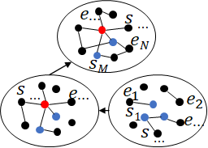
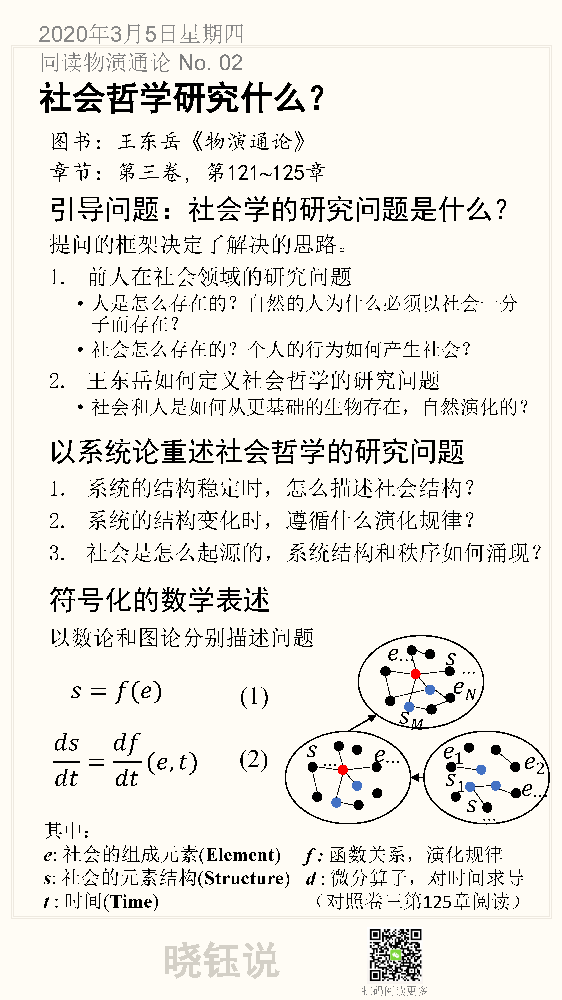

# 02. 社会哲学研究什么？

推荐章节：王东岳《物演通论》第三卷，第126**~**133章

> 【摘要】提问的框架决定了解决的思路。与之前的社会学研究不同，王东岳把社会和人放在物种的自然进化历程中，从更基础的生物存在来研究社会的自然演化，研究视角更开阔，比较容易看清楚本质，事实上这种跨界在科学研究上很常见。

## 引导问题：社会学的研究问题是什么？

提问的框架决定了解决的思路。

> 提问的框架决定了解决的思路。与之前的社会学研究不同，王东岳把社会和人放在物种的自然进化历程中，从更基础的生物存在来研究社会的自然演化，研究视角更开阔，比较容易看清楚本质，事实上这种跨界在科学研究上很常见。
>
> 提出一个问题往往比解决一个问题更为重要，因为解决一个问题也许是一个数学上或实验上的技巧问题。而提出新的问题、新的可能性，从新的角度看旧问题，却需要创造性的想像力，而且标志着科学的真正进步。
>
> ——爱因斯坦，1938年《物理学的进化》

首先回顾社会哲学领域，前人在社会领域的研究问题

- 人是怎么存在的？
- 自然的人为什么必须以社会一分子而存在？
- 社会怎么存在的？
- 个人的行为如何产生社会？

王东岳如何定义社会哲学的研究问题？

> 社会和人是如何从更基础的生物存在，自然演化的？

这里关键的不同，是研究视角更开阔，把人和动物、甚至非生物拉通来看。事实上这种跨界在科学研究上很常见，比如以类比生态学的方法来研究经济，近年来出现很多新的跨学科。

## 以系统论重述社会哲学的研究问题

我自己的背景是控制论，多年在工业企业进行产品研发的经验，打磨了我很深入去思考和应用控制论的思想，可以说系统论、控制论已经成了我建构世界的一个基层视角。

而且，我认为社会学用系统论和网络可以，是非常直接的。所以借用系统论的术语来重新描述王东岳关于社会哲学的研究问题如下：

1. **系统的结构稳定时，怎么描述社会结构？**
2. **系统的结构变化时，遵循什么演化规律？**
3. **社会是怎么起源的，系统结构和秩序如何涌现？**

## 符号化的数学表述

### 函数描述

没有比符号更能精准的描述问题了，而数学（包括数论和图论）又是最极致的符号。

这里虽然出现几个符号，只是为了简化后文描述，是吓唬人的纸老虎，想想符号的物理含义，很直接。

以函数来描述前两个研究问题，如下。

\1. 系统的结构稳定时，可以用社会个体与社会结构的函数关系来描述社会
$$
s=f(e)
$$
式中：

***e*** : 社会的组成元素(**E**lement)

***s***: 社会的元素结构(**S**tructure)

***f***: 函数关系，代表个体形成社会结构的社会学规律

可以用小写字母代表个体，用于微观研究，可以指导具体的问题分析，用大写字母代表全体集合，用于宏观研究，可以与统计结果最对比对理论做交叉验证。

描述集合的函数关系为：

$$
E=f(E)
$$
式中：

 $E=\{e_1,...,e_i,...,e_N\}$：所有社会组成元素的集合

 $S=\{s_1,...,s_j,...,e_M\}$：所有社会元素结构的集合

\2. 当社会结构变化时，可以用微分来描述社会结构的动力学规律
$$
\frac{\mathrm{d}s}{\mathrm{d}t} =\frac{\mathrm{d}f}{\mathrm{d}t}(𝑒,𝑡)
$$
 式中：

 $t$: 时间(**T**ime)

$d$: 微分算子，对时间求导

这里的数量关系还比较初步，原有关于函数的微积分，要用到社会结构的动力学分析，可能还需要做很多调整和变化。这里暂时先不去纠缠时间的哲学含义，笼统用t指代时间，用s对t的微分指代s的变化率。

### 图论描述

社会结构天然就是个网络，用网络来描述社会非常直观。

不过，这里复杂的在于网络的动力学变化过程，当受到外在条件变化时，如何描述网络的聚合离散，以及网络机构的变化，会比较有挑战。

## 本节卡片

