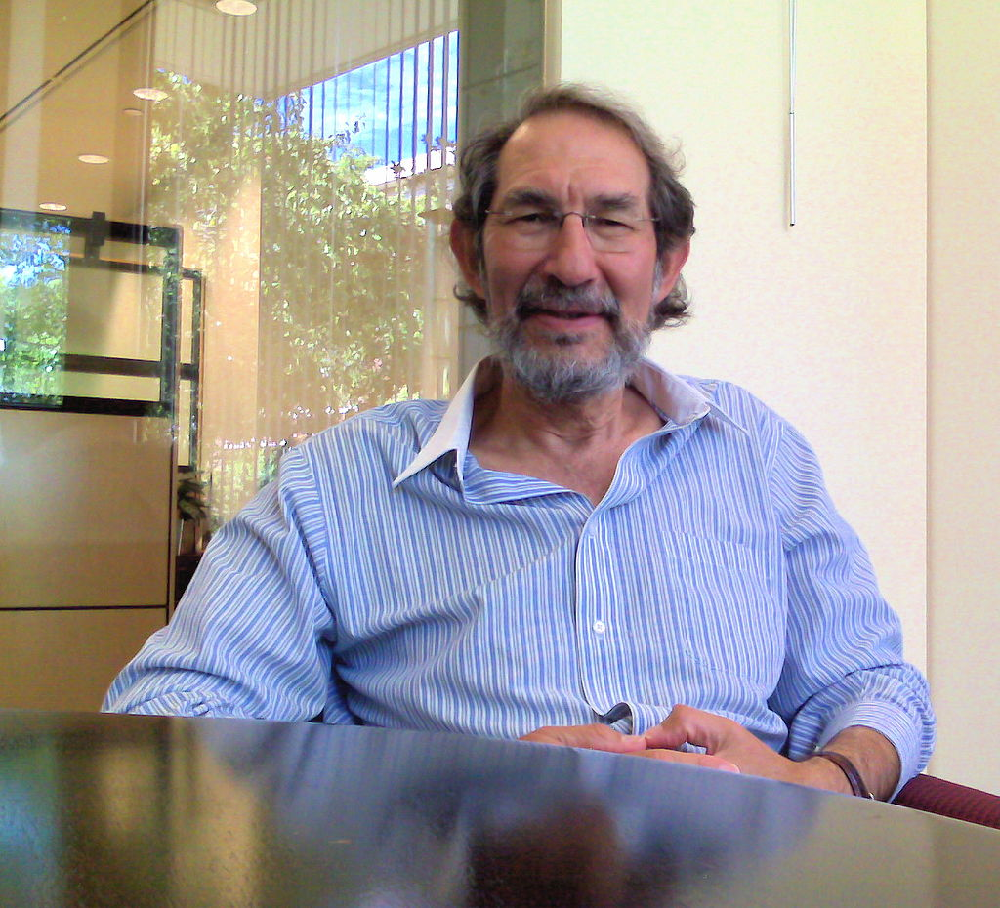
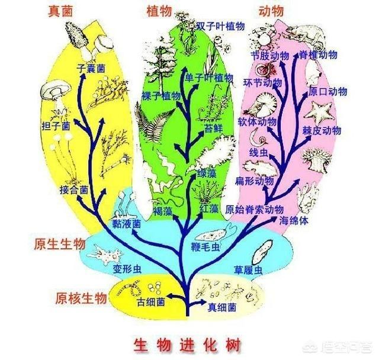
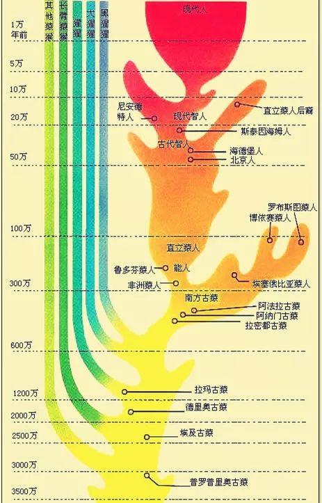
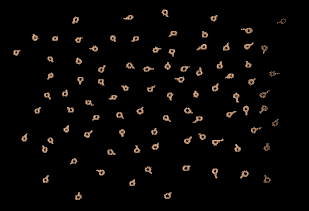

# 03. 生命是什么？个体生死与种族传承

> 【摘要】《物演通论》最大的创新，在于把生物和人放在一个规则下，把人类社会与生物社会放在一个规律下。所以，要研究人类社会，就要回望整个生物进化史。而我认为还可以更近一步，推演到物理的原子结构、量子机制，所以最近也在研究微观物理的结构，以对比研究公司企业的组织结构，看有什么新的启发。

今天的内容请参看《物演通论》第三卷，第126**~**133章，同时搜索生物进化史的相关知识。

[TOC]

## 引导问题

1. 宇宙万物是怎样层叠构成分层的系统结构？生命系统是如何演化的？

2. 考察从细胞到社会，不同层级的个体寿命

3. 个体死后，如何通过“社会”结构传承其种群的“命脉”？考察不同层级种群的寿命。

## 个体的短寿，及“社会”结构的形成

人生最大的问题，莫过于生死，但是一个人死了，他的精神和基因却能继续延续。

生物进化史，是种群的进化史，而不是个体的进化史。个人的命脉是“基因”，企业的命脉是“使命”。

- 个体的生命只能短暂地生存，《规模》提出个体的寿命与其规模的理论。

- 代际遗传使生命得以虚存，**个体**的“基因”在后代子孙组成的社会中维系其**种群**的“命脉”遗传。

| 物理     电子 | 化学     分子 | 生物存在 |        |      | 有机生命 | 地球   |
| ------------- | ------------- | -------- | ------ | ---- | -------- | ------ |
|               |               | 小细胞   | 大细胞 | 人   |          |        |
| 3ns           | 0.1ms         | 1秒      | 1天    | 80年 | 300万年  | 75亿年 |

## 生物的社会结构

| **社会结构**   | **组成元素**       | **个体特性e**       | **系统结构s**                           | **起源**         |
| -------------- | ------------------ | ------------------- | --------------------------------------- | ---------------- |
| 晚级  显性社会 | 现代智人           | 智质分化            | 高度结构化     类似分子结构(构型致密)   | 数十万年前       |
| 中级  潜在社会 | 多细胞动物(类人猿) | 体质残化            | 内组单元稀疏     类似原子结构(异质整合) | 5亿年前  寒武纪  |
| 初级  隐形社会 | 原始单细胞生物     | 同质化     基因相同 | 混沌、失构、无形  类似粒子群落(非整合)  | 35亿年前  太古宙 |

## 参考资料

王东岳的《物演通论》引用了大量古生物学知识，初次读的时候，容易被生物学词汇吓唬住。

我觉得梳理一下生物进化史之后，再看的时候，觉得翻来覆去的词汇也没几个，就容易开始穿透字面意思，来欣赏《物演通论》文字背后的美妙思想逻辑了。

图1 生物进化树

图2 生物进化的时间表

图3 人类进化时间表

图4 进化史一栏（动画）

## 本节卡片

