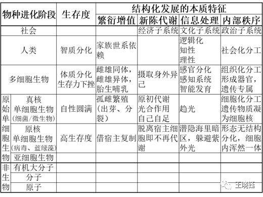
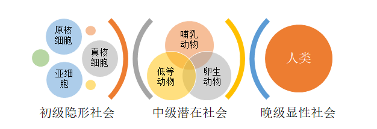
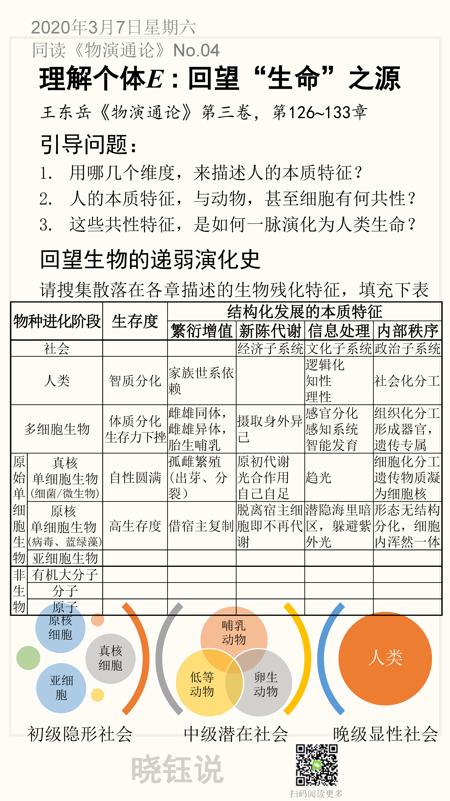

## 回望“生命”之源，理解生命个体E

之前在No.02中严格描述了社会哲学的研究内容。
$$
S=f(E)
$$

接下来对社会学规律的研究逻辑是：

1. 首先，精确描述社会存在$E$
2. 然后，精确描述社会结构$S$
3. 最后，精确描述社会规律。即社会存在$E$，如何产生社会结构S

今天回望生命演化历程中的各个阶段，有哪些共性的社会存在特征。请对照阅读王东岳《物演通论》第三卷，第126**~**133章。

## 引导问题

1. 用哪几个维度，来描述人的本质特征？

2. 人的本质特征，与动物，甚至细胞有何共性？

3. 这些共性特征，是如何一脉演化为人类生命？

## 回望生物的递弱演化史

先生仔细回顾了各个进化阶段的生物特征，《物演通论》展开了很多详细的描述。我请搜集散落在各章描述的生物残化特征，整理为下表。

为了更清晰的整理对比，每个阶段除了生存度（《物演通论》书中反复强调和对比），我还归纳了四个维度，分别是：

- 繁殖增值
- 新陈代谢
- 信息处理
- 内部秩序

下一节会解释为什么分为这四个维度。

我搜集散落在各章描述的生物残化特征，整理出生命不同演化阶段的结构特征。

表1 物种演化阶段的结构特征 

<table border=0 cellpadding=0 cellspacing=0 width=568 style='border-collapse:
 collapse;table-layout:fixed;width:426pt'>
 <col width=40 style='mso-width-source:userset;mso-width-alt:1280;width:30pt'>
 <col width=88 style='mso-width-source:userset;mso-width-alt:2816;width:66pt'>
 <col width=72 style='width:54pt'>
 <col width=92 span=4 style='mso-width-source:userset;mso-width-alt:2944;
 width:69pt'>
 <tr height=25 style='mso-height-source:userset;height:18.75pt'>
  <td colspan=2 rowspan=2 height=51 class=xl82 dir=LTR width=128
  style='border-right:.5pt solid black;border-bottom:1.0pt solid black;
  height:38.25pt;width:96pt'>物种进化阶段</td>
  <td rowspan=2 class=xl86 dir=LTR width=72 style='border-bottom:1.0pt solid black;
  width:54pt'>生存度</td>
  <td colspan=4 class=xl88 dir=LTR width=368 style='border-right:1.0pt solid black;
  border-left:none;width:276pt'>结构化发展的本质特征</td>
 </tr>
 <tr height=26 style='height:19.5pt'>
  <td height=26 class=xl65 dir=LTR width=92 style='height:19.5pt;border-top:
  none;border-left:none;width:69pt'>繁衍增值</td>
  <td class=xl65 dir=LTR width=92 style='border-top:none;border-left:none;
  width:69pt'>新陈代谢</td>
  <td class=xl65 dir=LTR width=92 style='border-top:none;border-left:none;
  width:69pt'>信息处理</td>
  <td class=xl66 dir=LTR width=92 style='border-top:none;border-left:none;
  width:69pt'>内部秩序</td>
 </tr>
 <tr height=31 style='height:23.25pt'>
  <td colspan=2 height=31 class=xl91 dir=LTR width=128 style='border-right:
  .5pt solid black;height:23.25pt;width:96pt'>社会</td>
  <td class=xl67 width=72 style='border-top:none;border-left:none;width:54pt'>　</td>
  <td class=xl68 dir=LTR width=92 style='border-top:none;border-left:none;
  width:69pt'>　</td>
  <td class=xl68 dir=LTR width=92 style='border-top:none;border-left:none;
  width:69pt'>经济子系统</td>
  <td class=xl68 dir=LTR width=92 style='border-top:none;border-left:none;
  width:69pt'>文化子系统</td>
  <td class=xl69 dir=LTR width=92 style='border-top:none;border-left:none;
  width:69pt'>政治子系统</td>
 </tr>
 <tr height=19 style='height:14.25pt'>
  <td colspan=2 rowspan=3 height=57 class=xl93 dir=LTR width=128
  style='border-right:.5pt solid black;border-bottom:.5pt solid black;
  height:42.75pt;width:96pt'>人类</td>
  <td rowspan=3 class=xl70 dir=LTR width=72 style='border-bottom:.5pt solid black;
  border-top:none;width:54pt'>智质分化　</td>
  <td rowspan=3 class=xl71 dir=LTR width=92 style='border-bottom:.5pt solid black;
  border-top:none;width:69pt'>家族世系依赖</td>
  <td rowspan=3 class=xl100 width=92 style='border-bottom:.5pt solid black;
  border-top:none;width:69pt'>　</td>
  <td class=xl71 dir=LTR width=92 style='border-top:none;border-left:none;
  width:69pt'>逻辑化</td>
  <td rowspan=3 class=xl103 dir=LTR width=92 style='border-bottom:.5pt solid black;
  border-top:none;width:69pt'>社会化分工</td>
 </tr>
 <tr height=19 style='height:14.25pt'>
  <td height=19 class=xl72 dir=LTR width=92 style='height:14.25pt;border-left:
  none;width:69pt'>知性</td>
 </tr>
 <tr height=19 style='height:14.25pt'>
  <td height=19 class=xl73 dir=LTR width=92 style='height:14.25pt;border-left:
  none;width:69pt'>理性</td>
 </tr>
 <tr height=19 style='mso-height-source:userset;height:14.25pt'>
  <td colspan=2 rowspan=3 height=76 class=xl93 dir=LTR width=128
  style='border-right:.5pt solid black;border-bottom:.5pt solid black;
  height:57.0pt;width:96pt'>多细胞生物</td>
  <td class=xl70 dir=LTR width=72 style='border-top:none;border-left:none;
  width:54pt'>体质分化</td>
  <td rowspan=3 class=xl71 dir=LTR width=92 style='border-bottom:.5pt solid black;
  border-top:none;width:69pt'>雌雄同体，雌雄异体，胎生哺乳</td>
  <td rowspan=3 class=xl71 dir=LTR width=92 style='border-bottom:.5pt solid black;
  border-top:none;width:69pt'>摄取身外异己</td>
  <td class=xl71 dir=LTR width=92 style='border-top:none;border-left:none;
  width:69pt'>感官分化</td>
  <td rowspan=3 class=xl103 dir=LTR width=92 style='border-bottom:.5pt solid black;
  border-top:none;width:69pt'>组织化分工，形成器官，遗传专属</td>
 </tr>
 <tr height=38 style='height:28.5pt'>
  <td height=38 class=xl74 dir=LTR width=72 style='height:28.5pt;border-left:
  none;width:54pt'>生存力下挫</td>
  <td class=xl72 dir=LTR width=92 style='border-left:none;width:69pt'>感知系统</td>
 </tr>
 <tr height=19 style='height:14.25pt'>
  <td height=19 class=xl75 width=72 style='height:14.25pt;border-left:none;
  width:54pt'>　</td>
  <td class=xl73 dir=LTR width=92 style='border-left:none;width:69pt'>智能发育　</td>
 </tr>
 <tr height=19 style='height:14.25pt'>
  <td rowspan=7 height=179 class=xl106 dir=LTR width=40 style='border-bottom:
  1.0pt solid black;height:134.25pt;border-top:none;width:30pt'>原始单细胞生物</td>
  <td class=xl70 dir=LTR width=88 style='border-top:none;border-left:none;
  width:66pt'>真核</td>
  <td rowspan=3 class=xl70 dir=LTR width=72 style='border-bottom:.5pt solid black;
  border-top:none;width:54pt'>自性圆满</td>
  <td class=xl71 dir=LTR width=92 style='border-top:none;border-left:none;
  width:69pt'>孤雌繁殖</td>
  <td class=xl71 dir=LTR width=92 style='border-top:none;border-left:none;
  width:69pt'>原初代谢</td>
  <td rowspan=3 class=xl71 dir=LTR width=92 style='border-bottom:.5pt solid black;
  border-top:none;width:69pt'>趋光</td>
  <td rowspan=3 class=xl103 dir=LTR width=92 style='border-bottom:.5pt solid black;
  border-top:none;width:69pt'>细胞化分工，遗传物质凝为细胞核</td>
 </tr>
 <tr height=38 style='height:28.5pt'>
  <td height=38 class=xl74 dir=LTR width=88 style='height:28.5pt;border-left:
  none;width:66pt'>单细胞生物</td>
  <td class=xl72 dir=LTR width=92 style='border-left:none;width:69pt'>(出芽、分裂）</td>
  <td class=xl72 dir=LTR width=92 style='border-left:none;width:69pt'>光合作用</td>
 </tr>
 <tr height=32 style='height:24.0pt'>
  <td height=32 class=xl76 dir=LTR width=88 style='height:24.0pt;border-left:
  none;width:66pt'>(细菌/微生物)</td>
  <td class=xl77 width=92 style='border-left:none;width:69pt'>　</td>
  <td class=xl73 dir=LTR width=92 style='border-left:none;width:69pt'>自己自足</td>
 </tr>
 <tr height=19 style='height:14.25pt'>
  <td height=19 class=xl70 dir=LTR width=88 style='height:14.25pt;border-top:
  none;border-left:none;width:66pt'>原核</td>
  <td rowspan=3 class=xl70 dir=LTR width=72 style='border-bottom:.5pt solid black;
  border-top:none;width:54pt'>高生存度</td>
  <td rowspan=3 class=xl71 dir=LTR width=92 style='border-bottom:.5pt solid black;
  border-top:none;width:69pt'>借宿主复制</td>
  <td rowspan=3 class=xl71 dir=LTR width=92 style='border-bottom:.5pt solid black;
  border-top:none;width:69pt'>脱离宿主细胞即不再代谢</td>
  <td rowspan=3 class=xl71 dir=LTR width=92 style='border-bottom:.5pt solid black;
  border-top:none;width:69pt'>潜隐海里暗区，躲避紫外光</td>
  <td rowspan=3 class=xl103 dir=LTR width=92 style='border-bottom:.5pt solid black;
  border-top:none;width:69pt'>形态无结构分化，细胞内浑然一体</td>
 </tr>
 <tr height=19 style='height:14.25pt'>
  <td height=19 class=xl74 dir=LTR width=88 style='height:14.25pt;border-left:
  none;width:66pt'>单细胞生物</td>
 </tr>
 <tr height=32 style='height:24.0pt'>
  <td height=32 class=xl76 dir=LTR width=88 style='height:24.0pt;border-left:
  none;width:66pt'>(病毒、蓝绿藻)</td>
 </tr>
 <tr height=20 style='height:15.0pt'>
  <td height=20 class=xl78 dir=LTR width=88 style='height:15.0pt;border-top:
  none;border-left:none;width:66pt'>亚细胞生物</td>
  <td class=xl78 dir=LTR width=72 style='border-top:none;border-left:none;
  width:54pt'>　</td>
  <td class=xl78 dir=LTR width=92 style='border-top:none;border-left:none;
  width:69pt'>　</td>
  <td class=xl78 dir=LTR width=92 style='border-top:none;border-left:none;
  width:69pt'>　</td>
  <td class=xl78 dir=LTR width=92 style='border-top:none;border-left:none;
  width:69pt'>　</td>
  <td class=xl79 dir=LTR width=92 style='border-top:none;border-left:none;
  width:69pt'>　</td>
 </tr>
 <tr height=19 style='height:14.25pt'>
  <td rowspan=3 height=58 class=xl109 dir=LTR width=40 style='border-bottom:
  1.0pt solid black;height:43.5pt;border-top:none;width:30pt'>非生物</td>
  <td class=xl68 dir=LTR width=88 style='border-top:none;border-left:none;
  width:66pt'>有机大分子</td>
  <td class=xl68 dir=LTR width=72 style='border-top:none;border-left:none;
  width:54pt'>　</td>
  <td class=xl68 dir=LTR width=92 style='border-top:none;border-left:none;
  width:69pt'>　</td>
  <td class=xl68 dir=LTR width=92 style='border-top:none;border-left:none;
  width:69pt'>　</td>
  <td class=xl68 dir=LTR width=92 style='border-top:none;border-left:none;
  width:69pt'>　</td>
  <td class=xl69 dir=LTR width=92 style='border-top:none;border-left:none;
  width:69pt'>　</td>
 </tr>
 <tr height=19 style='height:14.25pt'>
  <td height=19 class=xl80 dir=LTR width=88 style='height:14.25pt;border-top:
  none;border-left:none;width:66pt'>分子</td>
  <td class=xl80 dir=LTR width=72 style='border-top:none;border-left:none;
  width:54pt'>　</td>
  <td class=xl80 dir=LTR width=92 style='border-top:none;border-left:none;
  width:69pt'>　</td>
  <td class=xl80 dir=LTR width=92 style='border-top:none;border-left:none;
  width:69pt'>　</td>
  <td class=xl80 dir=LTR width=92 style='border-top:none;border-left:none;
  width:69pt'>　</td>
  <td class=xl81 dir=LTR width=92 style='border-top:none;border-left:none;
  width:69pt'>　</td>
 </tr>
 <tr height=20 style='height:15.0pt'>
  <td height=20 class=xl78 dir=LTR width=88 style='height:15.0pt;border-top:
  none;border-left:none;width:66pt'>原子</td>
  <td class=xl78 dir=LTR width=72 style='border-top:none;border-left:none;
  width:54pt'>　</td>
  <td class=xl78 dir=LTR width=92 style='border-top:none;border-left:none;
  width:69pt'>　</td>
  <td class=xl78 dir=LTR width=92 style='border-top:none;border-left:none;
  width:69pt'>　</td>
  <td class=xl78 dir=LTR width=92 style='border-top:none;border-left:none;
  width:69pt'>　</td>
  <td class=xl79 dir=LTR width=92 style='border-top:none;border-left:none;
  width:69pt'>　</td>
 </tr>
 <![if supportMisalignedColumns]>
 <tr height=0 style='display:none'>
  <td width=40 style='width:30pt'></td>
  <td width=88 style='width:66pt'></td>
  <td width=72 style='width:54pt'></td>
  <td width=92 style='width:69pt'></td>
  <td width=92 style='width:69pt'></td>
  <td width=92 style='width:69pt'></td>
  <td width=92 style='width:69pt'></td>
 </tr>
 <![endif]>
</table>

书中主要对比了生物社会的结构，而对非生物的微粒子只是简要提了一下。我最近翻看量子力学等近代物理，我认为对微观粒子的仔细研究，并跟生物社会对比，可以给我们很多启示。

## 社会结构的进化史

将上表生物进化的三个阶段，会形成三种社会结构，我用下图更清楚地描述和对比。

## 本节卡片

以上内容概要为一张卡片如下：

