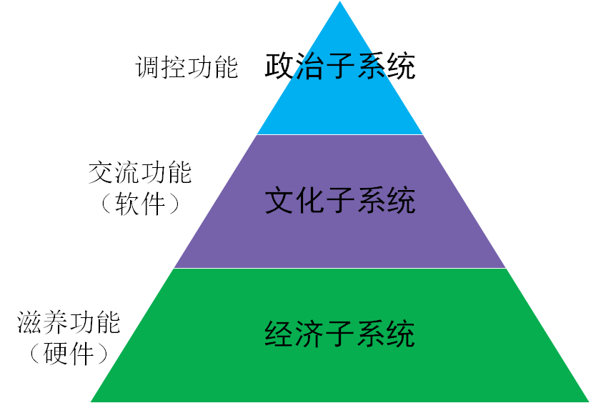
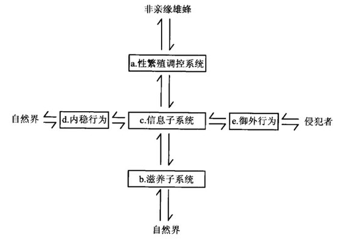
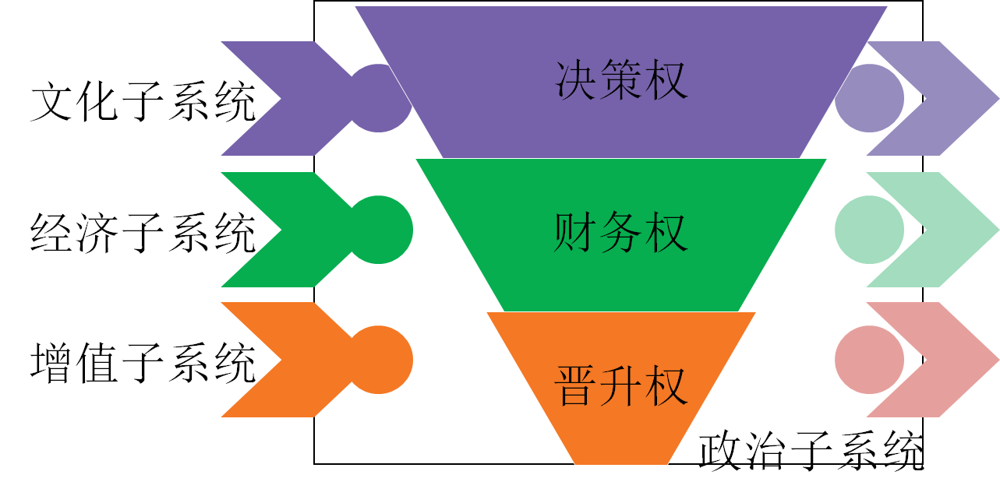
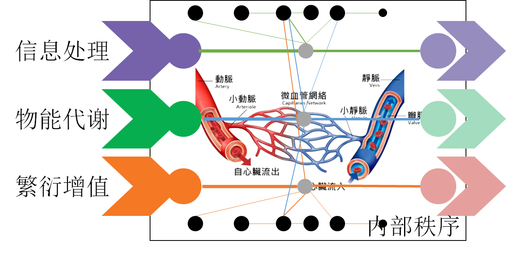
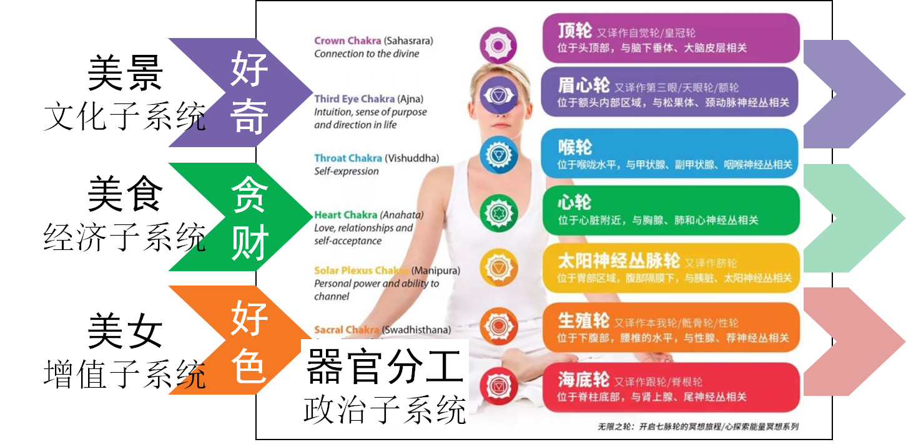
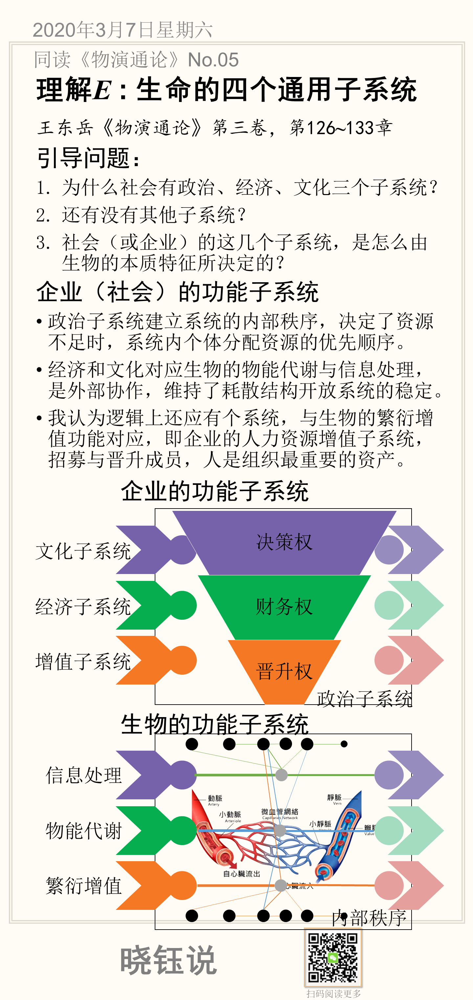

# 05. 理解个体E，生命的四个通用子系统

本节讨论生命和社会的四个通用子系统，请参阅王东岳《物演通论》第三卷，第126**~**133章。

## 引导问题：

1. 为什么社会有政治、经济、文化三个子系统？

2. 还有没有其他子系统？

3. 社会（或企业）的这几个子系统，是怎么由生物的本质特征所决定的？

## 社会的功能

在《物演通论》第153章，先生将社会结构划分为三大子系统：

- 滋养子系统（经济子系统）：实现个体与社会的物质能量交换，形成社会的硬件条件
- 信息子系统（文化子系统）：实现社会成员之间的联系，形成社会的软件条件
- 调控子系统（政治子系统）：实现社会结构的平衡调理，处于社会结构的高层，实现上下贯通和提携统带的功能。

以蜜蜂社会为例，社会耦合结构可以图示为：

对于其中将性增值与调控系统放在一起，我有些不同的思考。

1. 先生解释说，从初级社会、中级社会到中级社会，以性增值为核心的亲缘关系对社会进行整体性反馈调节。但是我认为，除了政治子系统的调控方式，除了亲缘关系，也可以通过文化子系统，或者滋养子系统。
2. 政治子系统的调控功能，是系统内部建立稳定秩序的，对于任何稀缺资源（无论是食物、信息还是伴侣），都需要通过政治子系统建立分配的优先级和秩序。而性增值是外部功能，与获取食物和信息一样，需要与外在系统进行交换。

## 社会的子系统

因此，我将“性增值”和“调控子系统”分开，并且分内部系统和外部系统，绘制一个企业的结构子系统如下图。

外部子系统包括

- 经济和文化对应生物的物能代谢与信息处理，是外部协作，维持了耗散结构开放系统的稳定。

- 生物的繁衍增值功能，即企业的人力资源增值子系统，招募与晋升成员，人是组织最重要的资产。

内部子系统只有政治子系统，用于建立系统的内部秩序，决定了资源不足时，系统内个体分配资源的优先顺序。

对应外部的三个子系统，政治子系统在企业表现为三种对应的权力：

- 晋升权：包括招聘、考评、提拔与淘汰
- 财务权：包括采购、生产、销售等，围绕经济价值增值环节
- 决策权：包括信息收集的网络，形成决策的过程，以及决策执行的网络。

在社会结构的不同阶段，这三种权力凸显程度不同。先生将性繁殖调控子系统放在一起，是看到了早期生物社会以性为基础建构秩序，但是随着社会发展，特别是轴心时代实现了超越文明突破之后，社会秩序越来越以经济、文化为基础来建立。

## 个体生命的外部API接口

社会的子系统，是由其每一个组成个体环环相扣连接而成的，因此，个体生命的外部接口，必然与社会子系统对应。

基于上述的社会结构框架，适用于任何有”生命“的系统的通用化外部接口，可以描述为：

## 人的外在特征

为了更好地理解个体生命的外部接口，可以用人来验证。

如果把一个人当做一个社会，也用上述框架描述，可以更直观的辅助我们校验和理解社会结构的框架。

- 凡人都爱三样：美女、美食、美景。人的天性就是贪财、好色，还爱凑热闹。

- 人的天性，与企业的经济、文化、招聘相似，是不同的生存压力下的最佳生存策略。

## 本节卡片

