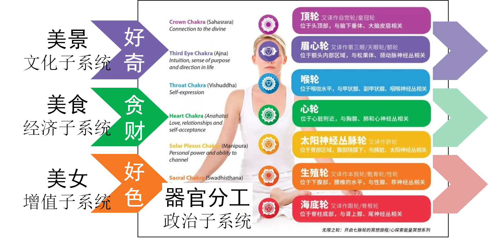
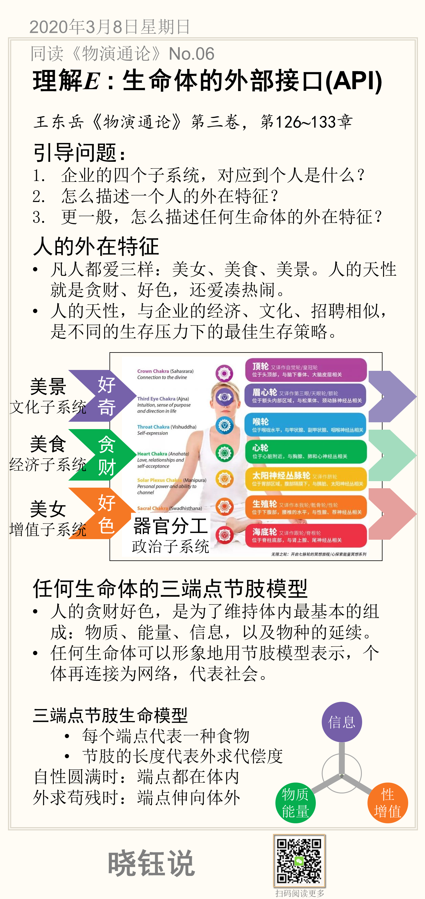

# 理解个体E: 生命体的外部接口(API)

[TOC]

如果能建立社会个体的标准化模型，识别出人们互动的方式，就可以通过计算机模拟，并基于个体之间的互动仿真来研究群体的行为模式以及动力学过程。

要建立生命体的模型，需定义外部接口和内部结构。本节先从外部功能提炼外部接口API(计算机词汇，应用程序的外部接口)，之后再提炼内部属性与内部结构。

这一基于《物演通论》第三卷，第126~133章对进化史的回朔，归纳出人的外在接口，并定义人的三端点节肢生命模型。

## 引导问题：

1. 企业有四个子系统（政治、经济、文化和繁殖），对应到个人和一般的个体生命，是否也存在四个子系统？
2. 抽象描述一个人，有那几个维度？人有哪些外在的特征？
3. 更一般，一般生命体有哪些外在特征？能否建立标准化的模型，并定义统一的内外部接口？

## 人的外在特征

归纳起来，凡人似乎都有三种外求：美女、美食、美景。人表现出的天性就是贪财、好色，还爱凑热闹。

这三种天性，似乎与企业的三个外在子系统相似：

- 美食，填报肚子，补给人体的物质和能量，类似经济子系统；
- 美景，享受美好的印象，类似企业的文化子系统；
- 美女，为了繁殖，类似企业通过招聘补给人员。

原以为人的个性繁杂，脾气秉性各部相同，似乎跟生硬的企业很相似。

而人体内的各个器官体质分化，构成人体内的美食、美景赏析的天然分工，类似企业和社会的政治系统。只不过人体通过体质分化天然建立了内部秩序，而企业需要复杂的组织架构。

## 本节卡片

