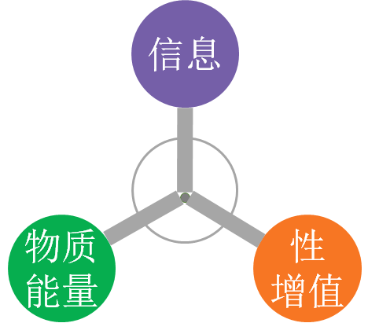
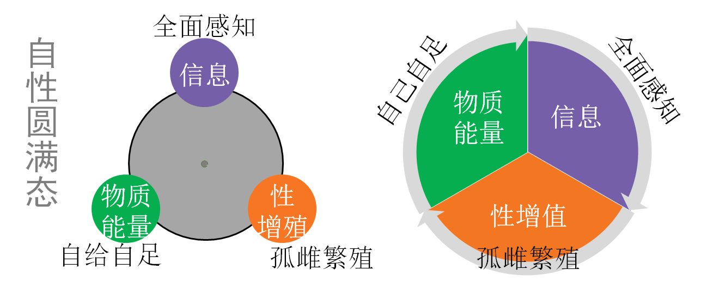
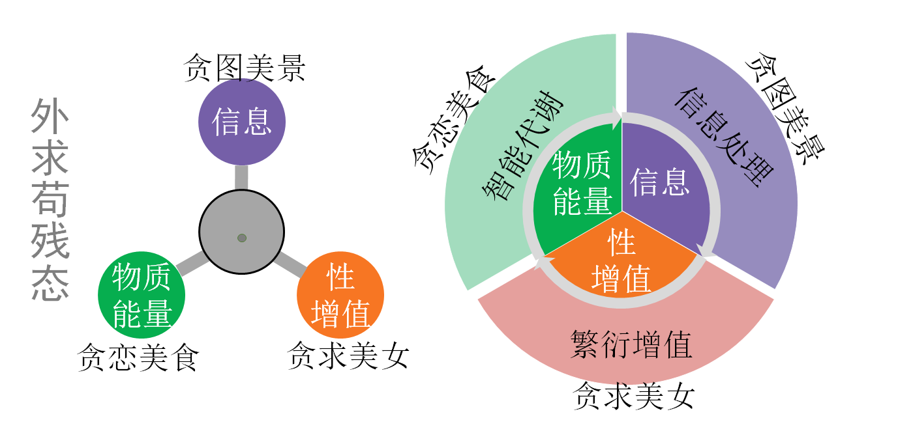
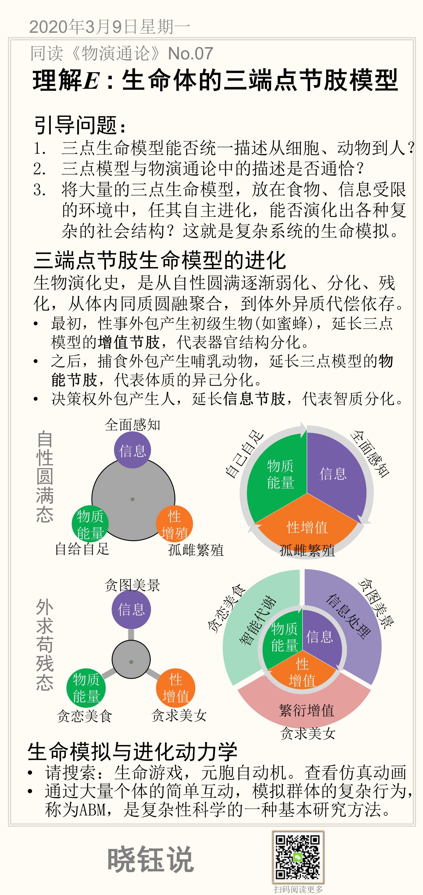

# 理解个体E: 一般生命体的三端点节肢模型

## 一般个体的外在特征

推而广之，任何生命体，无外乎对外追求物质、能量和信息源源不断的补给，对内将建立秩序，有序消耗优先的资源，最大限度维系生命的繁衍。所以人的贪财好色，是有生物的内在规定性的，无外乎是为了维持体内最基本的组成：物质、能量、信息，以及物种的延续。

1.三点模型能否统一描述从细胞、动物到人？

2.三点模型与物演通论中的描述是否通恰？

3.将大量的三点模型，放在食物、信息受限的环境中，任其自主进化，能否演化出各种复杂的社会结构？这就是复杂系统的生命模拟。

## 三端点节肢生命模型

更一般地，任何生命体可以形象地用节肢模型表示，个体再连接为网络，代表社会。

- 每个端点代表一种食物

- 节肢的长度代表外求代偿度

自性圆满时：端点都在体内

外求苟残时：端点伸向体外

## 三端点节肢生命模型的进化

生物演化是从自性圆满逐渐弱化、分化、残化，从体内同质聚合到体外异质依存。

- 初级社会，性事外包产生初级生物，延长三点模型的增值节肢，代表器官结构分化。

- 中级社会，捕食外包产生哺乳动物，延长三点模型的体能节肢，代表体质的异己分化。

- 晚级社会，决策权外包产生人，延长信息节肢，代表智质更极端的异己分化。

## 生命模拟与进化动力学

- 请搜索：生命游戏。查看仿真动画，很直观。

## 本节卡片

