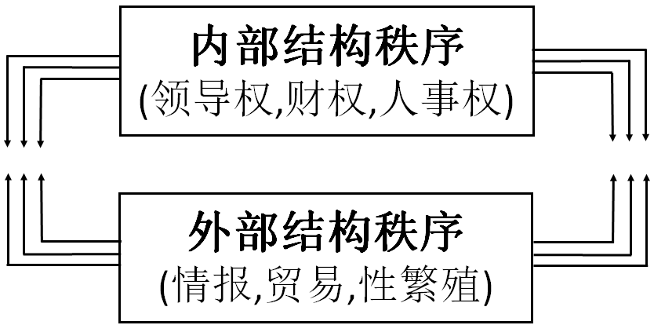
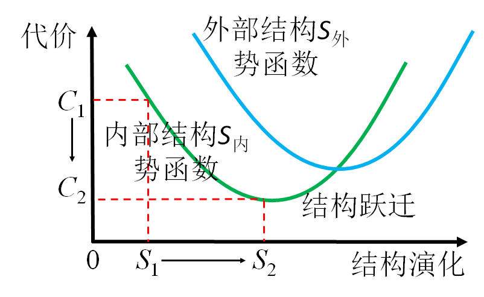

# 08. 如何理解社会结构 S ？

[TOC]

## 引导问题：

1. 有哪些日常用词实际在描述社会结构？（示例：架构、组织、体制等名称，保守、僵化、活力等形容，如构建、整合、变革、突破等行为）

2. 企业的内部结构与外部结构是什么关系，在描述和规律上有没有不同？

3. 社会结构固化的载体和流动的载体分别是什么？

## 系统内部结构与外部社会的互动

- 三端点个体模型，忽视了内部的政治子系统，是因为内部结构与外部结构完全同构。

- 内部结构与外部结构形成超稳态的互动关系，生物进化过程是从内部结构稳定的自给自足，逐渐过渡到依靠外部社会结构提供补给。

- 外部秩序是内部秩序的外向显化投射，是内部资源不足时，向外求索的自然扩张。

## 社会结构演化的简约原理

- 社会结构是从生物社群、粒子群落演化而来。

- 因为社会的总资源有限，所以社会结构 *S* 和个体内部结构*S*的演化过程必然遵循最小作用原理。

- 当外部结构更经济时，内部功能就被外部取代。

社会结构演化将一切可有可无的属性、作用和消耗压缩到最小。（参阅卷二81章）

## 本节卡片

