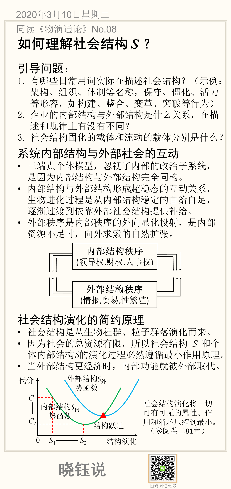

# 08. 社会结构 S 的一般理解和通用描述

开篇将社会学的问题，定义为寻找社会个体与社会结构的关系：
$$
S=f(E)
$$

上一部分（03节-07节）讨论了社会个体*E*的属性以及标准化描述。

接下来用几节讨论如何定量描述社会结构*S*。有了对社会个体与社会结构的精确描述，才有可能定量讨论社会规律。

中国人对社会关系，社会结构深有体会，但是要具体说清楚结构，还需要借助系统科学的视角。我从以下视角来讨论：

- 一般化的描述社会结构及其变化
- 静态社会结构
- 社会层次结构
- 社会结构演化与运动

## 引导问题

1. 有哪些日常用词实际在描述社会结构？（示例：架构、组织、体制等名称，保守、僵化、活力等形容，如构建、整合、变革、突破等行为）

2. 企业的内部结构与外部结构是什么关系，在描述和规律上有没有不同？

3. 社会结构固化的载体和流动的载体分别是什么？

## 系统内部结构与外部社会的互动

系统是层叠构成的。如：一个人处在社会关系当中，而内在又由身体器官组成内在结构。

在讨论社会个体的通用模型时，提出三端点个体模型，包含了经济、文化、增值三个子系统，但是有意忽略了政治子系统。忽视内部的政治子系统，是因为内部结构与外部结构完全同构。

- 内部结构与外部结构形成超稳态的互动关系，生物进化过程是从内部结构稳定的自给自足，逐渐过渡到依靠外部社会结构提供补给。

- 外部秩序是内部秩序的外向显化投射，是内部资源不足时，向外求索的自然扩张。

## 社会结构演化的简约原理

社会结构是从生物社群、粒子群落演化而来。但是进化过程并非完全连续，而是有很多阶跃。具体结构如何演化，取决于成本，或曰简约原理。

- 因为社会的总资源有限，所以社会结构 *S* 和个体内部结构*S*的演化过程必然遵循最小作用原理。
- 当外部结构更经济时，内部功能就被外部取代。
- 社会结构演化将一切可有可无的属性、作用和消耗压缩到最小。（参阅卷二81章）

## 本节卡片

