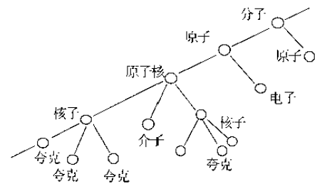
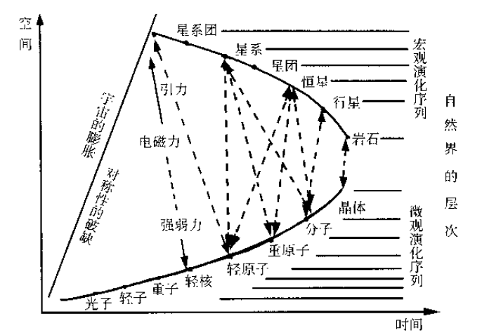
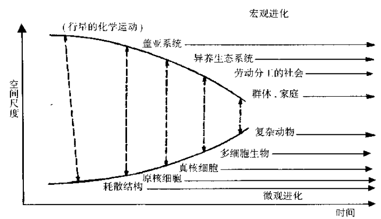

# 09. 理解结构 *S*：静态结构的精确表述

## 引导问题：

1. 社会结构*S*仅用分化程度描述太粗。现实社会的个体有差异、结构不对称，如何精确描述？

2. 社会政治和企业组织均有金字塔式的层级特征，这是普遍规律吗？能用分形更严谨地描述吗？

3. 同一层级中，个体的能力和重要性不同，组织也不均匀，什么样的结构才是稳定和可持续的？

## 自相似层叠的金字塔式纵深结构

- 不平等起源于生命本身，完全平等意味着死亡。物理定律打破了粒子的平等，对称性破缺产生了生命，人在动荡中稳定下来，形成层级社会。
- 自然之物，都是有褶皱的、不规则的、细圆齿状的，通常以自相似的形式层叠包裹。

自然存在物，似乎都有等级层次结构，在生物世界，这种层次关系更加明显。因为通过精巧的分层，可以更有效的分配获取的资源（物质、能量、信息），实现最大化生存的控制。

图1：由夸克到分子的系统层次结构

图2. 宇宙的宏观演化序列

图3. 生物个体和社会的共同进化

赫伯特·西蒙（1962年）从数学上证明了自然界之所以存在者系统的等级层次，是因为等级结构体的生存概率远远大于非等级层次结构体的生存概率。20世纪70年代美国的V.图琴在《科学的现象》(1977年)和W.鲍威斯在《行为：感知的控制》(1973年)提出复杂系统的的多层次控制模型，比利时F.海里津发展为进化控制理论。

- 层次结构涌现出生命神奇的第4维度，产生混乱、复杂、费解的生命活力。

杰弗里·韦斯特在《规模》中仔细研究了生物的分层结构，得到结论：生命系统通过分层涌现出神奇的新维度，在二维的平面填满三维结构，在三维的空间涌现出生命的第四维度。

图4. 层叠结构的等面积分支

## 含关键节点的不对称网络结构

在同一层级的个体，也并非均匀的。网络科学的研究揭示了平面内的结构。

- 同一物类或同一层级，有的以结构洞为中心聚拢，有的产生党派形成多社群博弈制衡。

- 什么网络结构是稳定的？什么群体模式可持续？

可以用一个个体连接的网络，图示一个社会结构，如下图为美国上市公司的网络结构，较大的公司节点也比较大，距离比较短的公司，代表两个公司的关系比较密切，股票价格的相关性较高。

图5. 美国上市公司的网络结构

要保持结构的稳定，需要满足稳定的必要条件：**May-Wingner稳定条件**
$$
𝑁 \cdot 𝐷 \cdot \alpha^2 < 1
$$

其中网络参数为：

$$N$$ : 网络节点总数

$$D$$ : 平均连接密度

$$\alpha$$: 平均连接强度

## 参考文献

1. 颜泽贤. 系统科学导论：复杂性探索[M].人民出版社, 2006.
2. 杰弗里·韦斯特,规模：复杂世界的简单法则[M].中信出版社.2018.
3. May R M. Food-web assembly and collapse: mathematical models and implications for conservation[J]. 2009.

## 本节卡片摘要

