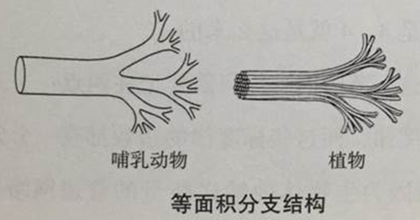

# 09. 理解结构 *S*：静态结构的精确表述

[TOC]

## 引导问题：

1. 社会结构*S*仅用分化程度描述太粗。现实社会的个体有差异、结构不对称，如何精确描述？

2. 社会政治和企业组织均有金字塔式的层级特征，这是普遍规律吗？能用分形更严谨地描述吗？

3. 同一层级中，个体的能力和重要性不同，组织也不均匀，什么样的结构才是稳定和可持续的？

## 自相似层叠的金字塔式纵深结构

- 不平等起源于生命本身，完全平等意味着死亡。物理定律打破了粒子的平等，对称性破缺产生了生命，人在动荡中稳定下来，形成层级社会。

- 自然之物，都是有褶皱的、不规则的、细圆齿状的，通常以自相似的形式层叠包裹。

- 层次结构涌现出生命神奇的第4维度，产生混乱、复杂、费解的生命活力。(参看《规模》第3章)

## 含关键节点的不对称网络结构

- 同一物类或同一层级，有的以结构洞为中心聚拢，有的产生党派形成多社群博弈制衡。

- 什么网络结构是稳定的？什么群体模式可持续？

可以用一个个体连接的网络，图示一个社会结构，如下图为美国上市公司的网络结构，较大的公司节点也比较大，距离比较短的公司，代表两个公司的关系比较密切，股票价格的相关性较高。

图2. 美国上市公司的网络结构

- May-Wingner稳定条件

$$
𝑁\cdot𝐷 \cdot \alpha^2<1
$$

其中网络参数为：

$N$ : 网络节点总数

$D$ : 平均连接密度

$\alpha$ : 平均连接强度

## 本节卡片摘要

