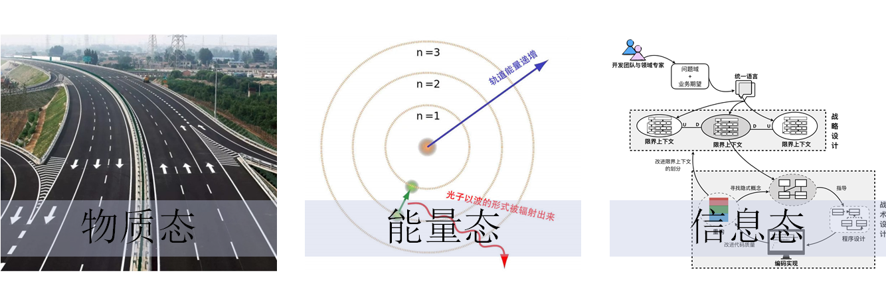
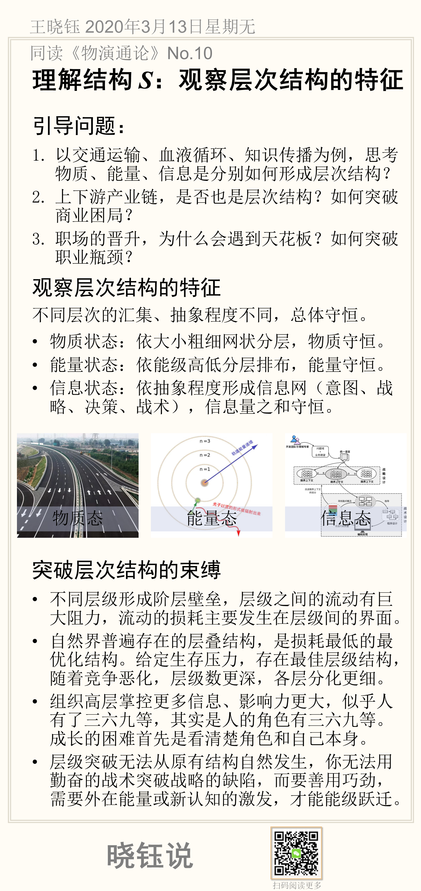

# 理解结构 S：观察层次结构的特征

这节来自于对静态结构的具体讨论。

## 引导问题

1. 以交通运输、血液循环、知识传播为例，思考物质、能量、信息是分别如何形成层次结构？

2. 上下游产业链，是否也是层次结构？如何突破商业困局？

3. 职场的晋升，为什么会遇到天花板？如何突破职业瓶颈？

## 观察层次结构的特征

不同层次的汇集、抽象程度不同，总体守恒。

- 物质状态：依大小粗细网状分层，物质守恒。

- 能量状态：依能级高低分层排布，能量守恒。

- 信息状态：依抽象程度形成信息网（意图、战略、决策、战术），信息量之和守恒。

## 突破层次结构的束缚

不同结构之间，似乎等级很难跨越。

- 不同层级形成阶层壁垒，层级之间的流动有巨大阻力，流动的损耗主要发生在层级间的界面。

- 自然界普遍存在的层叠结构，是损耗最低的最优化结构。给定生存压力，存在最佳层级结构，随着竞争恶化，层级数更深，各层分化更细。

- 组织高层掌控更多信息、影响力更大，似乎人有了三六九等，其实是人的角色有三六九等。成长的困难首先是看清楚角色和自己本身。

- 层级突破无法从原有结构自然发生，你无法用勤奋的战术突破战略的缺陷，而要善用巧劲，需要外在能量或新认知的激发，才能能级跃迁。

## 本节卡片摘要

