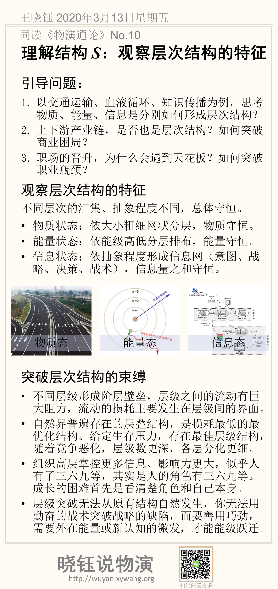

# 理解结构 S：层级结构的特征与规律

层级是存在结构的一个普遍形式，这节具体讨论层级的静态结构。

## 引导问题

1. 以交通运输、血液循环、知识传播为例，思考物质、能量、信息是分别如何形成层级结构？

2. 上下游产业链，是否也是层级结构？如何突破商业困局？

3. 职场的晋升，为什么会遇到天花板？如何突破职业瓶颈？

## 观察和理解层级

层级有很多近义词，层级、层级、等级、阶级等等。我们关注分层的本质结构。

**“层”：指物质、能量、信息的抽象（汇集）程度。**

比如人体循环的主动脉、支脉、毛细血管。同样的，对信息来说，有决策意图，决策战略方向，具体的决策，战术的层层细分。
即使在日常用语中，也有上位词（抽象概念），中位词（指代一类对象），下位词（指代一个对象）。不同层级之间是严格划分，不能交流的，日常交流的一种鸡同鸭讲的场景，就是上位词和下位词混用。

在工业时代的企业组织中，高层级的人掌控着信息、经济等，表现成人有了三六九等，其实是人的角色有三六九等。人修行的困难首先是看清楚角色和自己本身。

层级也可能指代进化的不同阶段，《物演通论》通过回望历史研究层级，实际上是研究不同进化阶段，这是层级结构在时间上的展开，而静态的层级架构，可以认为是相同结构在空间上的展开。

## 层级结构的特征与守恒律

层级结构是存在物的客观存在形式，是时间和空间的扭曲，任何进入该时空的存在必然按照结构的法则排列。

无论是物质流动、能量流动和信息流动都表现出层级的特点。不同层级的宽度大小，遵循一定的比例。而具体分多少个层级，每个节点包含多少个子节点，与生存压力有关。虽然不同层级的汇集、抽象程度不同，但总体守恒。

层级结构在物质、能量和信息的表现为：

- 物质状态：依空间大小粗细，以网状分层，物质守恒。
- 能量状态：依能级高低分层排布，能量守恒。
- 信息状态：依抽象程度形成信息网（意图、战略、决策、战术），信息量之和守恒。

### 物质态

- 物质存在，依空间大小粗细，以网状分层。每一层的大小、粗细不同，例如：交通网络（高速公路、主干道、羊肠小道），血液循环系统（动脉、支脉、毛细血管）。
- 物质守恒，每个层级的空间是相等的，在二维空间上表现为面积相等，在三维空间表现为流量相等。

图1. 物质态的层级结构

### 能量态

- 能量状态依能级高地：高能态、低能态，不同的能态之间，是中空地带，不能存在，不同能级之间变化是不连续的，低能级吸收光子和能量后，可以向高能级跃迁，高能级向低能级跃迁，释放出电子和能量。
- 所有的能量是守恒的，在不同层级的能量之。

图2. 能量态的层级结构

### 信息态

- 信息态的抽象层级：信息的抽象程度不一样，从意图、战略、决策、战术，逐层细化。信息传递上，不同层级的信息是严格隔离的，混用会引起混乱和扭曲。
- 信息守恒不会被创生，也不会消亡，每一层级的信息量之和相等。

图3. 信息态的层级结构

## 层级结构的规律

前面分析了守恒规律：物质、能量和信息在不同层级流动，总体是守恒的，每个层级之和是一样的。

除了守恒规律，层级结构还呈现一些其他规律。

- **量子规律**：
  微观来看，每个层是稳定的，层之间是不稳定的；宏观来看，存在鲜明的层级结构。
- **结构填充**：
  每一层级的属性取决于填充的个体数量，而与填充什么个体无关，即组织中的结构大于个体的个性。所以根据一个组织的层级个数，以及两个层级之间的能级差（跃迁的难度、产生变化的难度），可以判定其组成，就像根据原子的色谱，可以推断元素成分。这就是说，从结构可以推断属性，从形式可以推断内容。
- **不相容原理**：
  每个层级的容量有限，同一个位置不能容纳相同的个体存在。（类似电子的泡利不相容原理）。
- **最优原理**（简约原理，最小作用原理）：
  层次结构，是消耗最小，阻力最小，跃迁所需的激发能量最小的，其他的结构必然有额外的能耗，如果不是这样的结构，必然产生长线的副作用，是系统论的长路径，大延迟的反作用回路，会反过来优化层级结构趋于最优的。

## 突破层级结构的束缚

不同层级之间构成阶层，严格隔绝，难以流动，也无法替代（战术上的勤奋，无法挽救战略上的懒惰）。

- 不同层级形成阶层壁垒，层级之间的流动有巨大阻力，流动的损耗主要发生在层级间的界面。
- 自然界普遍存在的层叠结构，是损耗最低的最优化结构。给定生存压力，存在最佳层级结构，随着竞争恶化，层级数更深，各层分化更细。
- 组织高层掌控更多信息、影响力更大，似乎人有了三六九等，其实是人的角色有三六九等。成长的困难首先是看清楚角色和自己本身的差别。
- 层级突破无法从原有结构自然发生，你无法用勤奋的战术突破战略的缺陷，而要善用巧劲，需要外在能量或新认知的激发，才能能级跃迁。要推动层级变革，需要注入物质、能量、信息，所以只有开放的系统，才能从基层跃迁到高层，反过来，高层往基层下跃迁，可以释放出自由电子，来激发其他组织的跃迁。所以组织的第二曲线创新，关键是要找到这个能激发自己能级的第三者。
- 突破与创新发生在边缘地带，系统最外围的一层的组成，决定了系统整体的外在活力与表现。

## 关于层级结构的讨论

在同读《物演通论》的过程中，有幸能跟东岳先生学习坊的同学交流切磋。

> 【问】不同层之间的过渡或者跃迁。上中下的分野面是怎么形成的？量子跃迁在微观视界是非连续的，但是在宏观视界，这个非连续性，虽然用了突变一词，但是，真的是突变吗？是完全抽离时间的吗？
>
> 在无机和有机间，先生举了个马铃薯病原体的例子。在第十七章也论述过跃迁，但是没有清晰界定。

这是个很好的问题，我重述一下，并分解为三个问题：

1. 不同层之间，应当具备什么约束条件？
2. 不同条件（外部压力，生存条件，生存度等）下，应该分为几层？
3. 层是怎么分化的，是渐变还是突变？或者说，相变过程是什么？

我不能完全回答，说一下我的理解或者直觉。

### 1. 层级的约束条件

不同层之间有条件的，包括：

1. 面积等效原理，或守恒原理。下层虽然细而弱小，但是合并下层的属性后与上一层的属性完全相等（无论指）。
2. 简约原理，稳定的层级结构，对物质、能量、信息的有效传递和加工，是损耗最小的。
3. 稳定条件，形成的层级结构，必须是稳定的，与其他可能的结构的势能相比是个凹地。

### 2. 层级个数

特定压力下，应该分几层？
我觉得跟系统的规模有关，当一个系统的内部规模给定，外部资源给定时，有一个最优的分层个数。比如，人体的循环系统，从动脉到毛细血管，有几层的分叉，是匹配人体细胞数量和规模的一个最优解。
我猜想，用前面第一个问题的三个条件，可以推到出来第二个问题的答案。

### 3. 层级如何分化

第3个问题，跟突变论有关。本质上渐变还是突变，与光是连续波动态还是量子粒子态，应该源自同一个更本质的问题。

突变理论用渐变解释了突变，建立了数学模型，但是，我觉得没有给出物理学意义上机理的解释。我暂时对这个问题的思路，还不清晰。

如果这几个问题真说清楚了，我们就能仿真一个给定规模的系统，在限定资源和环境压力下的层级结构。指导公司：分几个决策层级，每一个层级的管理范围，职责边界等，至少是最优理想结构。

如果能回答清楚第三个问题，还能给出现有的组织结构，往最优结构怎么演化（渐变、或突变）的路径。

## 本节卡片摘要

