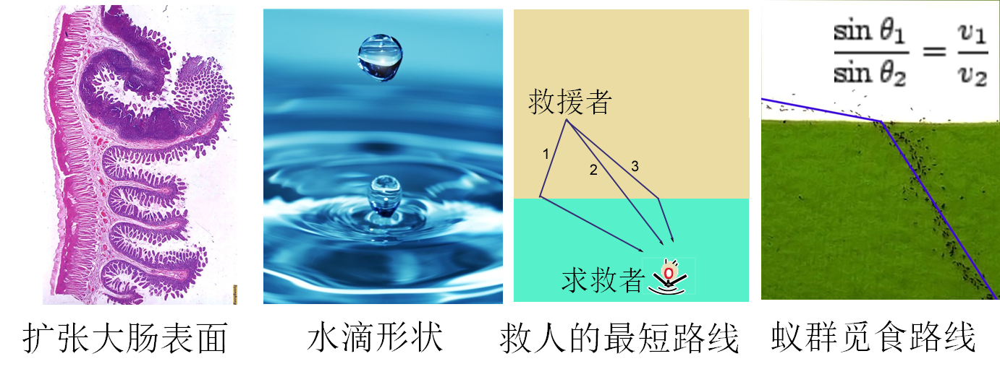
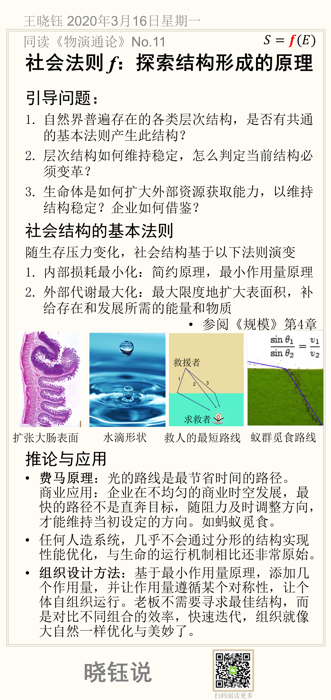

# 社会法则 f：探索结构形成的原理

## 引导问题：

1. 自然界普遍存在的各类层次结构，是否有共通的基本法则产生此结构？

2. 层次结构如何维持稳定，怎么判定当前结构必须变革？

3. 生命体是如何扩大外部资源获取能力，以维持结构稳定？企业如何借鉴？

## 社会结构的基本法则

社会结构的法则，归纳到最后竟然如此简单。

> 随生存压力变化，社会结构基于以下法则演变
>
> 1. 内部损耗最小化：简约原理，最小作用量原理
> 2. 外部代谢最大化：最大限度地扩大表面积，补给存在和发展所需的能量和物质

通俗地说，就是“开源节流”。所以真正的问题是：什么才是真正开源（不影响节流的开源）？什么才是真正节流（不影响开源的节流）？

参阅《规模》第4章

## 推论与应用

**费马原理**：光的路线是最节省时间的路径。
 商业应用：企业在不均匀的商业时空发展，最快的路径不是直奔目标，随阻力及时调整方向，才能维持当初设定的方向。如蚂蚁觅食。

任何人造系统，几乎不会通过分形的结构实现性能优化，与生命的运行机制相比还非常原始。

**组织设计方法**：基于最小作用量原理，添加几个作用量，并让作用量遵循某个对称性，让个体自组织运行。老板不需要寻求最佳结构，而是对比不同组合的效率，快速迭代，组织就像大自然一样优化与美妙了。

## 本节卡片摘要

