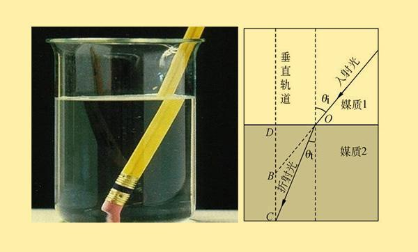
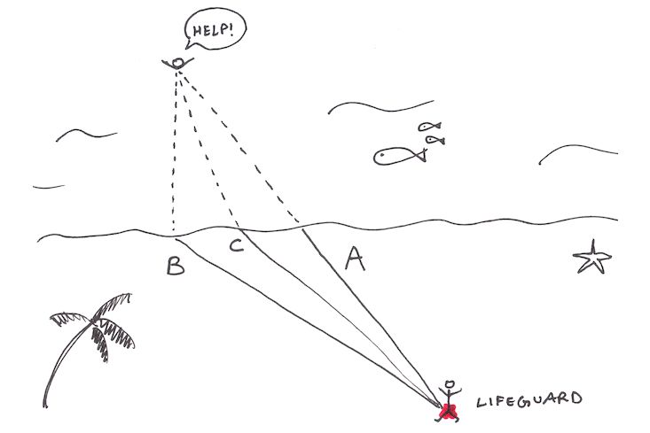
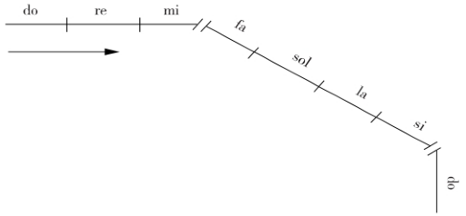

# 社会法则 f：探索结构形成的原理

> 【摘要】根本的社会结构法则，竟然如此简单：内部损耗最小化（简约原理，最小作用量原理），外部代谢最大化（最大限度地扩大表面积，补给能量和物质）。通俗地说，就是“开源节流”，然而，真正的问题是：什么才是真正开源（不影响节流的开源），什么才是真正节流（不影响开源的节流）？

## 引导问题：

1. 自然界普遍存在的各类层次结构，是否有共通的基本法则产生此结构？

2. 层次结构如何维持稳定，怎么判定当前结构必须变革？

3. 生命体是如何扩大外部资源获取能力，以维持结构稳定？企业如何借鉴？

## 社会结构的基本法则

社会结构的法则，归纳到最后竟然如此简单。

**随生存压力变化，社会结构基于最优化的法则演变，即**

1. **内部损耗最小化：简约原理，最小作用量原理**
2. **外部代谢最大化：最大限度地扩大表面积，补给存在和发展所需的能量和物质**

通俗地说，就是“开源节流”。然而，真正的问题是：

- 什么才是真正开源（不影响节流的开源）？
- 什么才是真正节流（不影响开源的节流）？

参阅《规模》第4章。

## 推论与应用

1. **费马原理：光的路线是最节省时间的路径。****

由于光在不同的不同物质的传播速度不同，在不同媒介的界面上，就会发生折射，保证光子始终沿着最节省的时间的路径。

2. **商业应用：最快的路径不是直奔目标**

企业在不均匀的商业时空发展，最快的路径不是直奔目标，随阻力及时调整方向，才能维持当初设定的方向。如蚂蚁觅食，如救人的最佳路线。

任何人造系统，几乎不会通过分形的结构实现性能优化，与生命的运行机制相比还非常原始。通过学习自然，提升商业系统的活力和韧性。

3. **企业组织设计方法**

基于最小作用量原理，添加几个作用量，并让作用量遵循某个对称性，让个体自组织运行。老板不需要寻求最佳结构，而是对比不同组合的效率，快速迭代，组织就像大自然一样优化与美妙了。

4. **学习的台阶，需要外在帮助**

音乐上也有类似的“折线”，音阶从do到si被分为七个不相等的频率段，速度在mi和fa之间发生偏向。

图3. 不连续音节的转折（来源《探索奇迹》）

音阶可以作为一种对学习和成长的隐喻，一般我们刚开始学习的时候进步很快，慢慢地学习速度会慢下来，速度的减缓会引起成长方向的偏移，但我们自己很难觉察。

在这些转向的关键时刻，需要借助老师等外部力量，提醒我们自己看不见的方向扭转。所以真正的成长，无法完全靠个人的埋头苦练。之前练拳的时候，师父说这些关键时刻，需要师父来“换劲”，才能再上一个台阶。

## 本节卡片摘要

