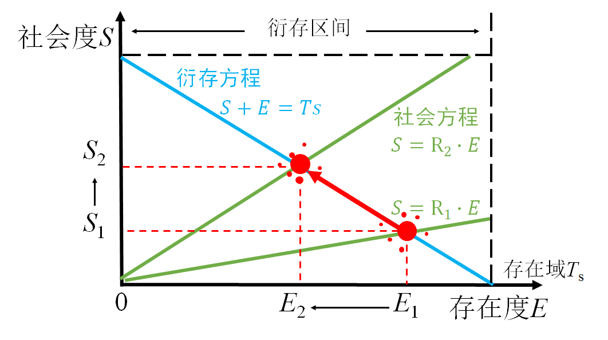
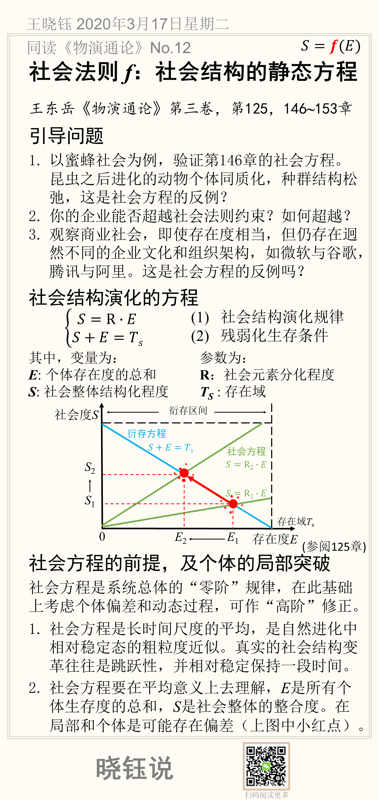

# 参数R: 如何减少代偿效应的损耗

$$
𝑆=𝒇(𝐸)
$$

王东岳《物演通论》第三卷，第125，146**~**153章

## 引导问题

1.以蜜蜂社会为例，验证第146章的社会方程。昆虫之后进化的动物个体同质化，种群结构松弛，这是社会方程的反例？

2.你的企业能否超越社会法则约束？如何超越？

3.观察商业社会，即使存在度相当，但仍存在迥然不同的企业文化和组织架构，如微软与谷歌，腾讯与阿里。这是社会方程的反例吗？

## 社会结构演化的方程

$$
\left\{\begin{matrix}
S=R \cdot E & (1)\\ 
S+E=T_S & (2)
\end{matrix}\right.
$$

其中（1）为社会结构演化规律，（2）为残弱化生存条件。

式中变量为：

***E***: 个体存在度的总和

$S$: 社会整体结构化程度

参数为：

**R**：社会元素分化程度

**T**_**S** : 存在域

## 社会方程的前提，及个体的局部突破

社会方程是系统总体的“零阶”规律，在此基础上考虑个体偏差和动态过程，可作“高阶”修正。

1. 社会方程是长时间尺度的平均，是自然进化中相对稳定态的粗粒度近似。真实的社会结构变革往往是跳跃性，并相对稳定保持一段时间。

2. 社会方程要在平均意义上去理解，*E*是所有个体生存度的总和，*S*是社会整体的整合度。在局部和个体是可能存在偏差（上图中小红点）。

## 本节卡片摘要

