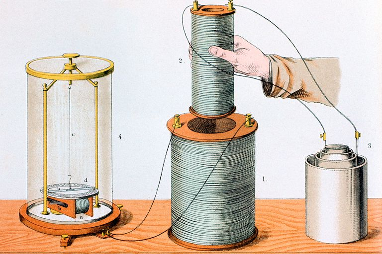

# 社会法则 *f*：感应代偿定律的猜想

本节类比电磁感应定律，提出"感应代偿定律的猜想"，给出社会法则 的严格描述
$$
𝑆=𝒇(𝐸)
$$

## 引导问题

1. 上节说物演通论是平均意义上的大尺度“零阶”规律，如果推广到高阶动态过程？

2. 如何定义递弱代偿原理的核心参数？

3. 如何具体数量化描述企业的组织结构变革？

## 从“递弱代偿”到“感应代偿”的思路

递弱代偿的核心不在“递弱”，“递弱”只是熵增定律的推广，在社会学中表现为社会存在*E*有递弱的趋势。递弱代偿的核心也不在“代偿”，“代偿”是普遍的观察，社会结构*S*的强存进化，是社会发展史事实的观察。这两点都不是东岳先生的独创。

东岳先生的核心贡献，在于揭示了存在的“递弱”运动，会感生出“代偿”的动势。这即可以应用于熵增的封闭系统，也可以适用于逆商的生命系统，递弱代偿的核心在于感应规律。

类比电磁感应定律就比较清楚，我想可以将递弱代偿过程包括动力感应和代偿运动两阶段：

- 动力感应规律反映存在度递失的感应效应和代偿效应，它产生变革势能（记为感应动势**F**）。

- 感应动势不一定立刻引起结构代偿，感应动势累计到一定程度，才会产生结构变革**S** ，释放感应的势能伴随一定损耗。这是代偿运动规律。

## 感应代偿定律的猜想

任何封闭系统（包括自然存在、精神存在、社会存在）内部的流通运动，都有保持运动的惯性。流通速度的变化，会感应出阻碍变化的感应动势。

① 感应动势**F**的方向，总要阻碍引起流通运动的变化。（类似电磁学的楞次定律）

② 感应动势**F**的大小，正比于穿过这一系统流通量的变化率。（类似法拉第电磁感应定律）

感应代偿产生的感生动势为如下，称作“感应动力方程”
$$
F=-L \cdot N \cdot \frac {dE} {dt}
$$

感生动势作用在特定系统，会产生结构演化，并产生一定的损耗，方程如下，称作”代偿运动方程“
$$
S=\frac {F}{R}
$$

式中，变量为：

- $$E$$: 系统内的流通量总和
- $$F$$: 系统变革的感应动势
- $$S$$: 系统的结构化度量

参数为：

- $$N$$: 感应耦合系数
- $$L$$: 感应能力系数
- $$R$$: 代偿损耗系数

这是以集中参数表达的方程，电磁学中麦克斯韦方程将电磁感应定律推广到了分布式参数，这里就不再展开。

社会中的感应代偿，与电磁学中的变量对比。

| 变量/参数 | 感应代偿定律 | 变量/参数 | 电磁感应定律 |
| --------- | ------------ | --------- | ------------ |
| F         | 感应动力     | u         | 电压         |
| Φ         | 感应动势     | Φ         | 电动势       |
| S         | 代偿         | i         | 电流         |
| K         |              | K         | 线圈耦合系数 |
| L         |              | L         | 电感         |
| R         |              | R         | 电阻         |

## 递弱代偿原理的直观解释

“递弱代偿”原理，通过产生出相反的代偿效应，在一定程度上阻碍变化的发生，产生“有效代偿”。但是“有效代偿”永远不可能消除变化，所以代偿终究是无效的。

如同下图描述的法拉第电磁感应定律，如果不考虑电磁感应，手松开后磁铁会做自由落体，但是电磁感应的电动势会产生阻碍，让磁铁像降落在一个弹簧上有个缓冲，缓缓降落。这也是物演通论的递弱代偿效应。

## 本节卡片摘要

