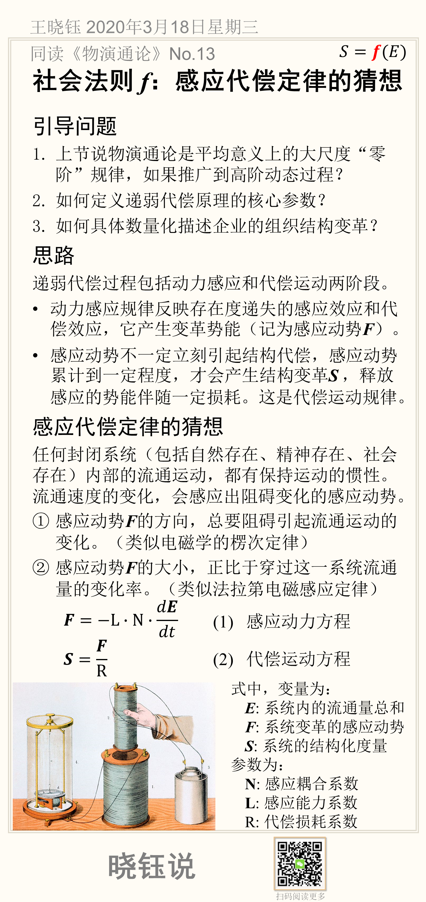

# 社会法则 *f*：感应代偿定律的猜想

$$
𝑆=𝒇(𝐸)
$$

## 引导问题

1. 上节说物演通论是平均意义上的大尺度“零阶”规律，如果推广到高阶动态过程？

2. 如何定义递弱代偿原理的核心参数？

3. 如何具体数量化描述企业的组织结构变革？

## 思路

递弱代偿过程包括动力感应和代偿运动两阶段。

- 动力感应规律反映存在度递失的感应效应和代偿效应，它产生变革势能（记为感应动势**F**）。

- 感应动势不一定立刻引起结构代偿，感应动势累计到一定程度，才会产生结构变革**S** ，释放感应的势能伴随一定损耗。这是代偿运动规律。

## 感应代偿定律的猜想

任何封闭系统（包括自然存在、精神存在、社会存在）内部的流通运动，都有保持运动的惯性。流通速度的变化，会感应出阻碍变化的感应动势。

① 感应动势**F**的方向，总要阻碍引起流通运动的变化。（类似电磁学的楞次定律）

② 感应动势**F**的大小，正比于穿过这一系统流通量的变化率。（类似法拉第电磁感应定律）
$$
F=-L \cdot N \cdot \frac {dE} {dt}
$$

$$
S=\frac {F}{R}
$$

式中，变量为：

- **E**: 系统内的流通量总和

- **F**: 系统变革的感应动势

- **S**: 系统的结构化度量

参数为：

- **N**: 感应耦合系数

- **L**: 感应能力系数

- R: 代偿损耗系数

## 本节卡片摘要

