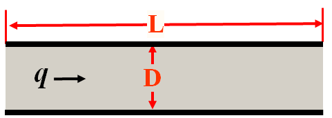
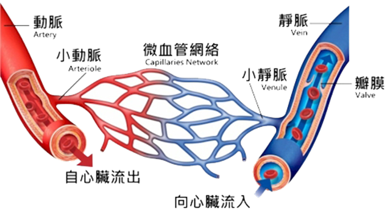
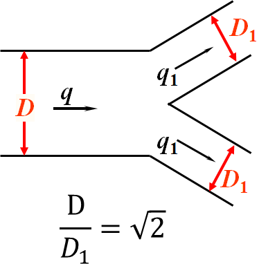
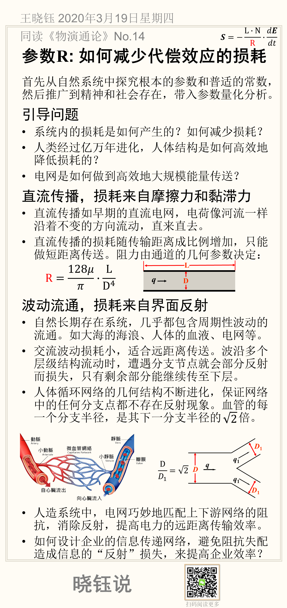

# 参数R: 如何减少代偿效应的损耗

$$
𝑆=𝒇(𝐸)
$$

首先从自然系统中探究根本的参数和普适的常数，然后推广到精神和社会存在，带入参数量化分析。

## 引导问题

•系统内的损耗是如何产生的？如何减少损耗？

•人类经过亿万年进化，人体结构是如何高效地降低损耗的？

•电网是如何做到高效地大规模能量传送？

直流传播，损耗来自摩擦力和黏滞力

•直流传播如早期的直流电网，电荷像河流一样沿着不变的方向流动，直来直去。

•直流传播的损耗随传输距离成比例增加，只能做短距离传送。阻力由通道的几何参数决定：
$$
R=\frac{128 \mu }{\pi}\cdot \frac{L}{D^4}
$$

## 波动流通，损耗来自界面反射

自然长期存在系统，几乎都包含周期性波动的流通。如大海的海浪、人体的血液、电网等。

- 交流波动损耗小，适合远距离传送。波沿多个层级结构流动时，遭遇分支节点就会部分反射而损失，只有剩余部分能继续传至下层。

- 人体循环网络的几何结构不断进化，保证网络中的任何分支点都不存在反射现象。血管的每一个分支半径，是其下一分支半径的$$sqrt(2)$$倍。

- 人造系统中，电网巧妙地匹配上下游网络的阻抗，消除反射，提高电力的远距离传输效率。

- 如何设计企业的信息传递网络，避免阻抗失配造成信息的“反射”损失，来提高企业效率？

## 本节卡片摘要

