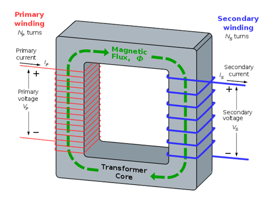
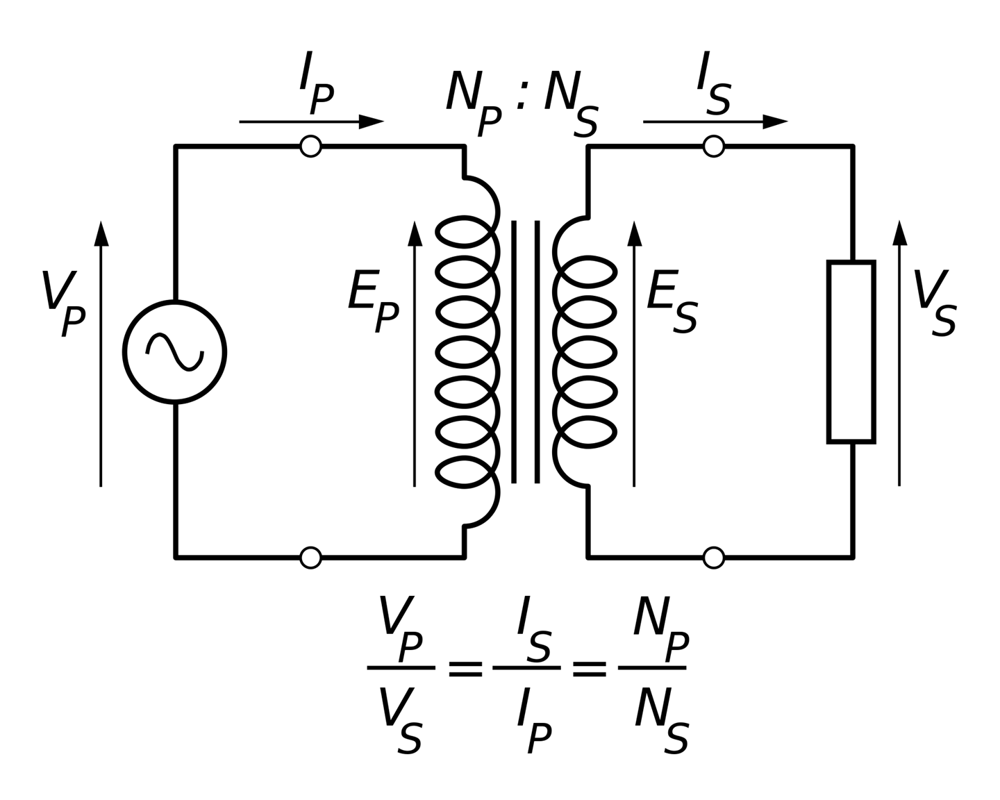
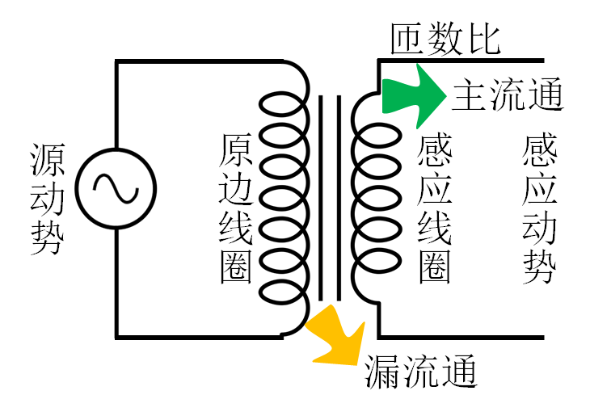
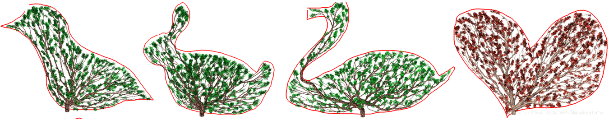
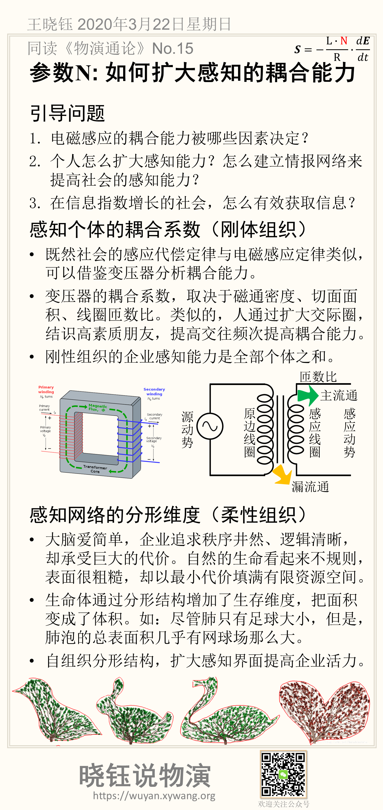

# 参数N: 如何扩大感知的耦合能力

$$
𝑆=- \frac{L \cdot N}{R} \cdot \frac{dE}{dt}
$$

影响感知能力N的因素：

- 感知终端个体的耦合能力
- 感知网络的结构，决定了有限资源空间内的感知面大小
- 感知还受注意力的影响

本节讨论决定感知能力的结构。

## 引导问题

1. 电磁感应的耦合能力被哪些因素决定？

2. 个人怎么扩大感知能力？怎么建立情报网络来提高社会的感知能力？

3. 在信息指数增长的社会，怎么有效获取信息？

## 感知个体的耦合系数（刚体组织）

既然社会的感应代偿定律与电磁感应定律类似，可以借鉴变压器分析耦合能力。变压器实现磁场的高强度耦合，结构和模型如下：

变压器的耦合能力，取决于磁通密度、切面面积、线圈匝数比。变压器的感应电动势为：
$$
E=4.44\cdot  (N \cdot B\cdot A)f
$$

- $$f$$是磁场的频率（单位为Hz）
- $$N$$是线圈的圈数；
- $$\phi$$ 是线圈磁通量
- $$A$$是线圈内空间（铁芯）的切面面积（单位为m2）；
- $$B$$是通过线圈内空间（铁芯）的磁通密度（单位为Wb/m2）。
- 常数值4.44是根据法拉第电磁感应定律证明而得的常数。

类似的，人是如何提高感知耦合能力的呢？

- 扩大交际圈（相当于增加切面面积$$A$$）
- 结识高素质朋友（相当于增加磁通密度$$B$$)
- 提高交往频次（提高磁场的频率$$f$$）

一般而言，普遍的耦合系数模型如下图：

对于刚性的企业和组织，整体的感知能力是全部个体之和。而对于柔性的组织，还可以通过向自然生命学习分形结构。

## 感知网络的分形维度（柔性组织）

- 大脑爱简单，企业追求秩序井然、逻辑清晰，却承受巨大的代价。自然的生命看起来不规则，表面很粗糙，却以最小代价填满有限资源空间。

- 生命体通过分形结构增加了生存维度，把面积变成了体积。如：尽管肺只有足球大小，但是，肺泡的总表面积几乎有网球场那么大。

- 自组织分形结构，扩大感知界面提高企业活力。

## 本节卡片摘要

