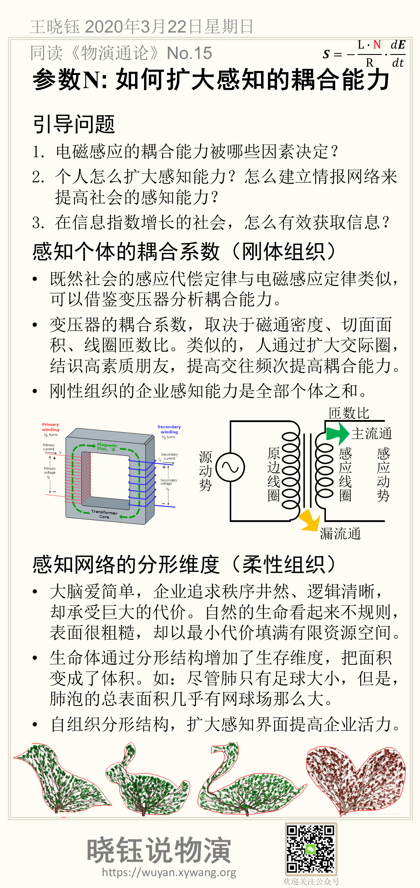

# 参数*N*: 如何充分发挥感知力？

> 虽然感知依赖感官和网络，但是感知能力不只是硬件。
> 虽然数字化转型首先要有数据，但不是所有的数据都是资产。
> 只有从价值出发，才能看清楚数字化之路。

## 引导问题

1. 感知能力*N*不只是感官的耦合能力与感应网络，还需要许多软技能。个人如何提高觉知能力？

2. 自组织应对不确定时，怎么避免盲目与混乱？

3. 美国911前已有大量情报，为何不能预防灾难？很多工厂虽然有大量数据、报表，却是数据孤岛，如何让数据产生价值？

## 感知软技能：聚焦注意力

- 人都有五官，却会视而不见、听而不闻、心猿意马。选择性地聚焦注意力，才能提高觉知力。

- 个体的感知，只有被管理层关注时，才能有效流动、成为企业的感知。

- 选择性地聚焦企业的注意力，通过文化、奖惩机制固化选择的原则，让有价值的声音被表达，把最敏锐的个体感知，变成企业的感知。

## 感知软技能：有目的地感知

以输出带动输入，是比较有效的学习，称为“费曼学习法”。只有知道怎么使用，才能有效地感知。盲目的感知，只能获得数据孤岛。

- 盲目建设大数据平台，是数字化转型的误区。感知是数字化的第一步，却是最后被定义的。必须从价值定位出发，倒着做数字化转型。

- 数字化驱动价值创造的三步曲：
  - 采集信息，实现数字化感知；
  - 分析信息，实现智能化决策；
  - 采取行动，实现价值化闭环。
- 但是数字化转型的思考，是要倒着规划的：
  - 从明确的价值定位出发，先想清楚要达成什么效果，实现什么价值
  - 明确决策点，筛选待决策的可能性空间
  - 根据决策的需要，确定要采集的数据

## 本节卡片摘要

