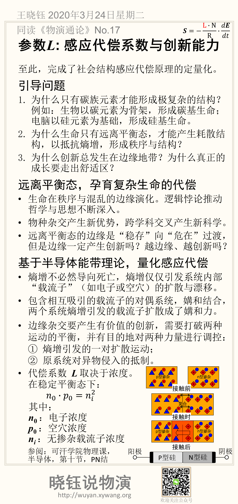

# 参数*L*: 感应代偿系数与创新能力

至此，完成了社会结构感应代偿原理的定量化。

## 引导问题

1. 为什么只有碳族元素才能形成极复杂的结构？例如：生物以碳元素为骨架，形成碳基生命；电脑以硅元素为基础，形成硅基生命。

2. 为什么生命只有远离平衡态，才能产生耗散结构，以抵抗熵增，形成秩序与结构？

3. 为什么创新总发生在边缘地带？为什么真正的成长要走出舒适区？

## 原理平衡态，孕育复杂生命的代偿

- 生命在秩序与混乱的边缘演化。逻辑悖论推动哲学与思想不断深入。

- 物种杂交产生新优势，跨学科交叉产生新科学。

- 远离平衡态的边缘是“稳存”向“危在”过渡，但是边缘一定产生创新吗？越边缘、越创新吗？

图：埃舍尔的画

## 基于半导体能带理论，量化感应代偿

- 熵增不必然导向死亡，熵增仅仅引发系统内部“载流子”（如电子或空穴）的扩散与漂移。

- 包含相互吸引的载流子的对偶系统，媾和结合，两个系统熵增引发的载流子扩散成了媾和力。

- 边缘杂交要产生有价值的创新，需要打破两种运动的平衡，并有目的地对两种力量进行调控：
   ① 熵增引发的一对扩散运动；
   ② 原系统对异物侵入的抵制。

代偿系数 **L** 取决于浓度。在稳定平衡态下：
$$
𝑛_0 \cdot 𝑝_0=𝑛_𝑖^2
$$

其中：

$$n_0$$ ：电子浓度

$$p_0$$ ：空穴浓度

$$n_i$$ ：无掺杂载流子浓度

## 参考

关于半导体能带理论，推荐花几分钟，看一下可汗学院物理课视频（半导体Semiconductors，第十节，PN结）。B站有翻译，链接：https://www.bilibili.com/video/av37527124/

## 本节卡片摘要

