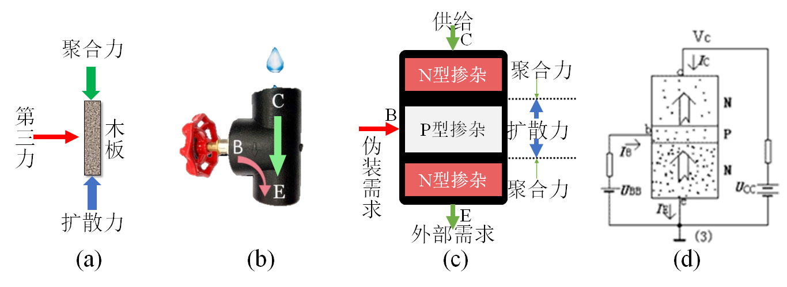
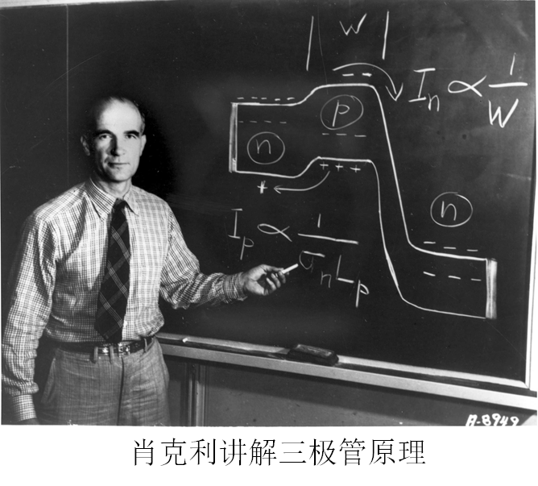
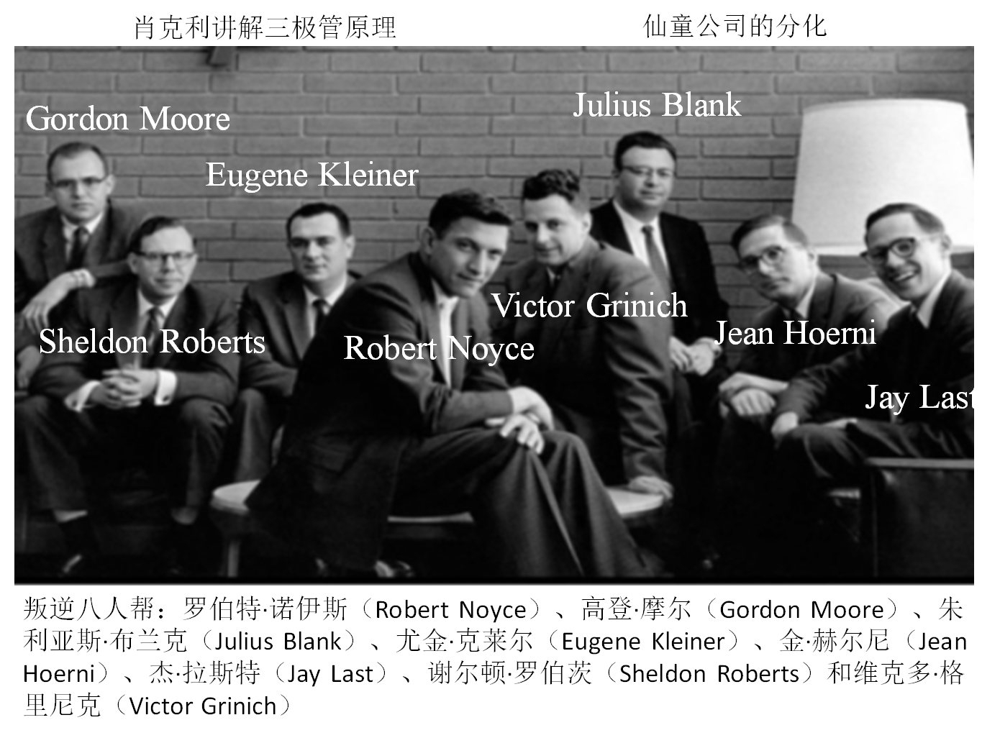
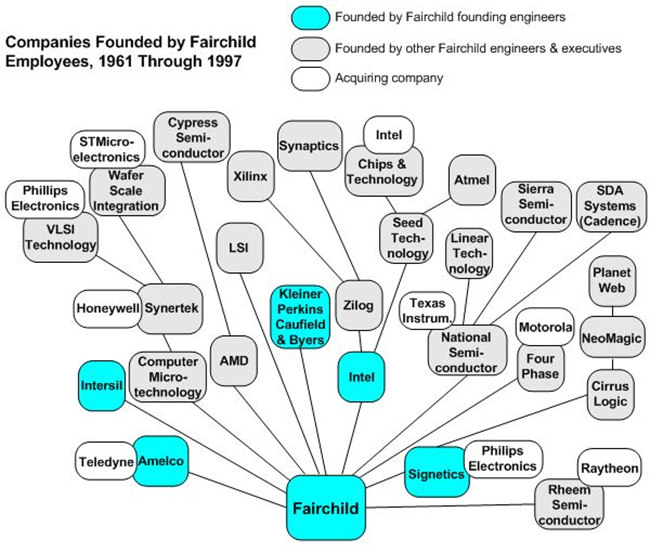
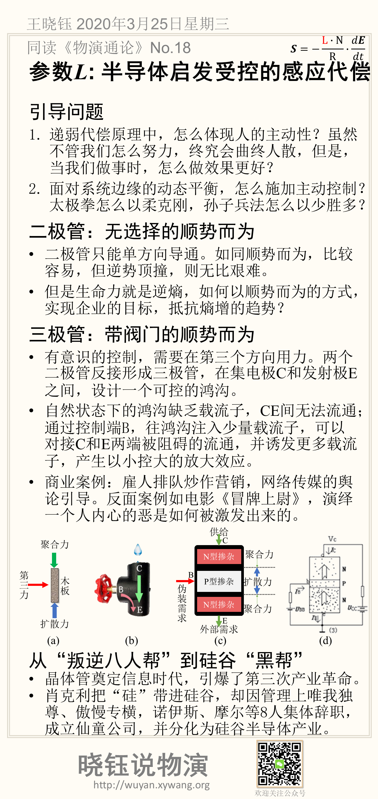

# 参数L: 半导体启发受控的感应代偿

## 引导问题

1. 递弱代偿原理中，怎么体现人的主动性？虽然不管我们怎么努力，终究会曲终人散，但是，当我们做事时，怎么做效果更好？

2. 面对系统边缘的动态平衡，怎么施加主动控制？
    太极拳怎么以柔克刚，孙子兵法怎么以少胜多？

## 二极管：无选择的顺势而为

- 二极管只能单方向导通。如同顺势而为，比较容易，但逆势顶撞，则无比艰难。

- 但是生命力就是逆熵，如何以顺势而为的方式，实现企业的目标，抵抗熵增的趋势？

## 三极管：带阀门的顺势而为

- 有意识的控制，需要在第三个方向用力。两个二极管反接形成三极管，在集电极C和发射极E之间，设计一个可控的鸿沟。

- 自然状态下的鸿沟缺乏载流子，CE间无法流通；通过控制端B，往鸿沟注入少量载流子，可以对接C和E两端被阻碍的流通，并诱发更多载流子，产生以小控大的放大效应。

- 商业案例：雇人排队炒作营销，网络传媒的舆论引导。反面案例如电影《冒牌上尉》，演绎一个人内心的恶是如何被激发出来的。

## 从“叛逆八人帮”到硅谷“黑帮”

晶体管是信息时代的基础，引爆了第三次产业革命，以晶体管技术为基础的高科技革命，几乎影响到了人类生活的每一个方面。肖克利与巴丁、布莱顿因此获诺贝尔奖。

肖克利把“硅”带进硅谷，却因管理上唯我独尊、傲慢专横，诺伊斯、摩尔等8人集体辞职，成立仙童公司，并分化为硅谷半导体产业。

- 1956年，肖克利创立第一家半导体公司，把“硅”带进“硅谷”。肖克利是技术天才，却在管理上唯我独尊、傲慢专横。

- 1957年9月18日，诺伊斯、摩尔等8人集体辞职，被肖克利骂为“叛逆八人帮”。然而，他们创立的仙童公司之后分化为硅谷半导体产业。这天后来被纽约时报评为美国历史上最重要的十天中的一天。

图4 仙童公司的分化

## 本节卡片摘要

