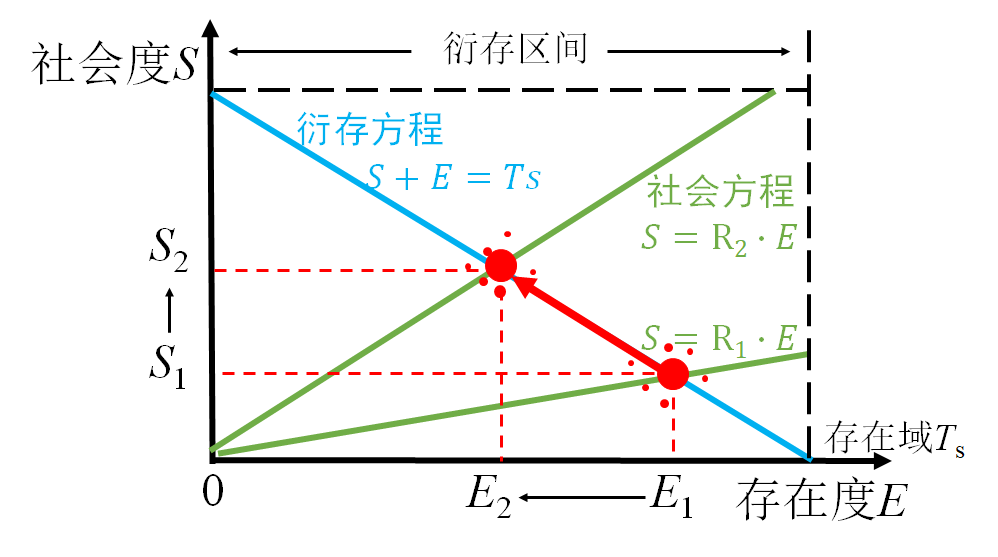
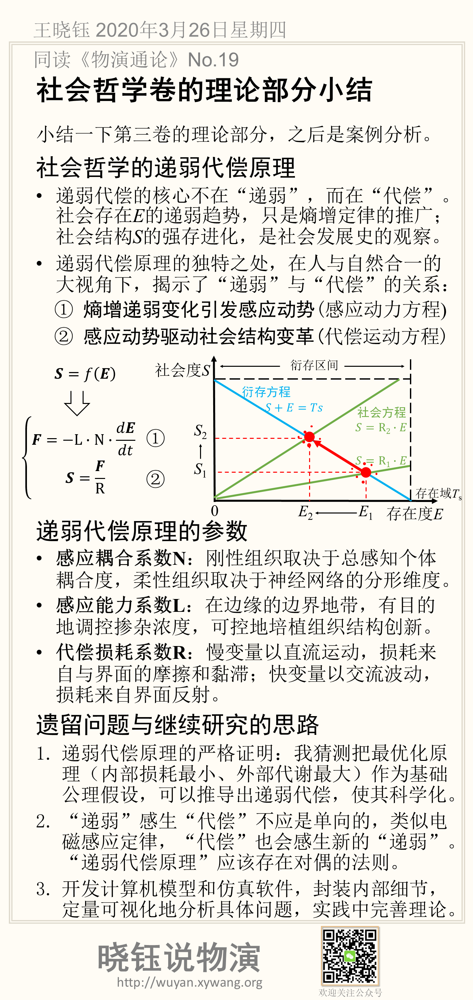

# 社会哲学卷的理论部分小结

小结一下第三卷的理论部分，之后是案例分析。

## 社会哲学的递弱代偿原理

- 递弱代偿的核心不在“递弱”，而在“代偿”。社会存在*E*的递弱趋势，只是熵增定律的推广；社会结构*S*的强存进化，是社会发展史的观察。

- 递弱代偿原理的独特之处，在人与自然合一的大视角下，揭示了“递弱”与“代偿”的关系：

① 熵增递弱变化引发感应动势(感应动力方程)

$$
F=-L \cdot N \cdot \frac {dE} {dt}
$$
② 感应动势驱动社会结构变革(代偿运动方程)
$$
S=\frac {F}{R}
$$

社会演化的零阶简约近似为：
$$
\left\{\begin{matrix}
S=R \cdot E & (1)\\ 
S+E=T_S & (2)
\end{matrix}\right.
$$
可以如图表示：

## 递弱代偿原理的参数

### 感应耦合系数N

刚性组织取决于总感知个体耦合度，柔性组织取决于神经网络的分形维度。

### 感应能力系数L

在边缘的边界地带，有目的地调控掺杂浓度，可控地培植组织结构创新。

### 代偿损耗系数R

慢变量以直流运动，损耗来自与界面的摩擦和黏滞；快变量以交流波动，损耗来自界面反射。

## 遗留问题与继续研究的思路

1.递弱代偿原理的严格证明：我猜测把最优化原理（内部损耗最小、外部代谢最大）作为基础公理假设，可以推导出递弱代偿，使其科学化。

2.“递弱”感生“代偿”不应是单向的，类似电磁感应定律，“代偿”也会感生新的“递弱”。“递弱代偿原理”应该存在对偶的法则。

3.开发计算机模型和仿真软件，封装内部细节，定量可视化地分析具体问题，实践中完善理论。

## 本节卡片摘要

