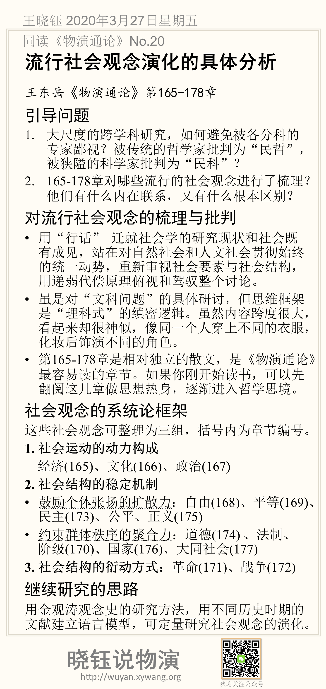

# 流行社会观念演化的具体分析

王东岳《物演通论》第165-178章

## 引导问题

1. 大尺度的跨学科研究，如何避免被各分科的专家鄙视？被传统的哲学家批判为“民哲”，被狭隘的科学家批判为“民科”？

2. 166-178章对哪些流行的社会观念进行了梳理？他们有什么内在联系，又有什么根本区别？

## 对流行社会观念的梳理与批判

- 用“行话” 迁就社会学的研究现状和社会既有成见，站在对自然社会和人文社会贯彻始终的统一动势，重新审视社会要素与社会结构，用递弱代偿原理俯视和驾驭整个讨论。

- 虽是对“文科问题”的具体研讨，但思维框架是“理科式”的缜密逻辑。虽然内容跨度很大，看起来却很神似，像同一个人穿上不同的衣服，化妆后饰演不同的角色。

- 第165-178章是相对独立的散文，是《物演通论》最容易读的章节。如果你刚开始读书，可以先翻阅这几章做思想热身，逐渐进入哲学思境。

## 社会观念的系统论框架

这些社会观念可整理为三组，括号内为章节编号。

**1.** **社会运动的动力构成**

经济(165)、文化(166)、政治(167)

**2.** **社会结构的稳定机制**

维持社会稳定的大量概念，深入每一个个体并形成主流社会文化。

有活力的社会稳定，来自两方面力量的平衡，一种是鼓励个体张扬，保持社会结构具有足够的涨落、多样性和变异度，这是系统各维度的裕量储备，构成系统可控的基础，可控的基础；另一种力量，是维持社会秩序聚合，是对内在多样性涨落可控的兑现。

- 鼓励个体张扬的扩散力：自由(168)、平等(169)、民主(173)、公平、正义(175)

- 约束群体秩序的聚合力：道德(174) 、法制、阶级(170)、国家(176)、大同社会(177)

3. 社会结构的衍动方式：

   革命(171)、战争(172)

## 继续研究的思路

用金观涛观念史的研究方法，用不同历史时期的文献建立语言模型，可定量研究社会观念的演化。因为我的兴趣在于商业，所以后续不会具体展开这个研究。但是，我会更深入去思考具体企业的组织和管理相关的观念演化。

## 本节摘要卡片

