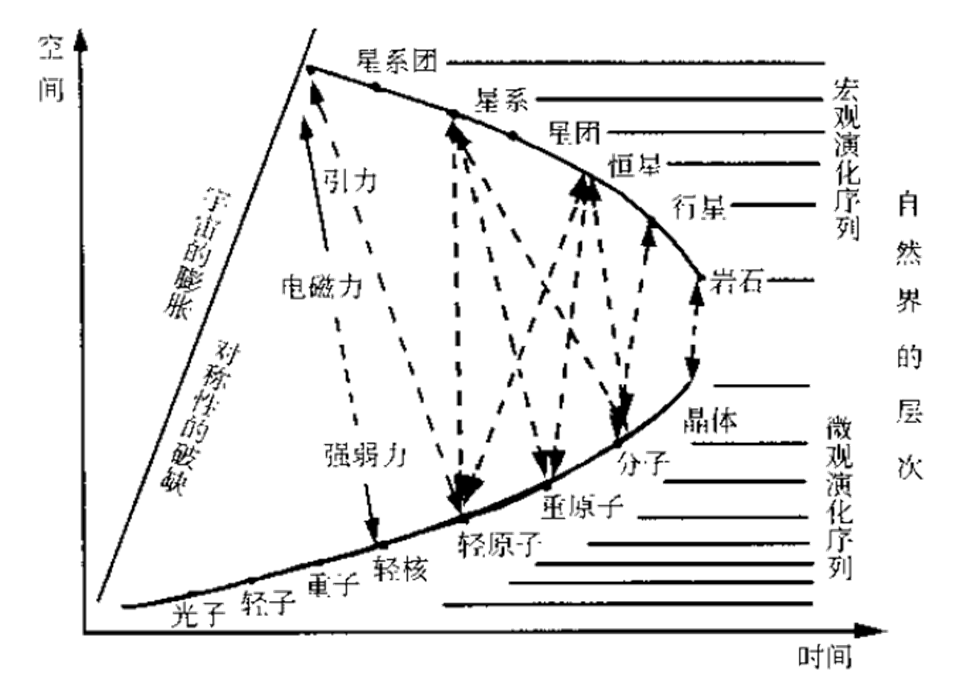
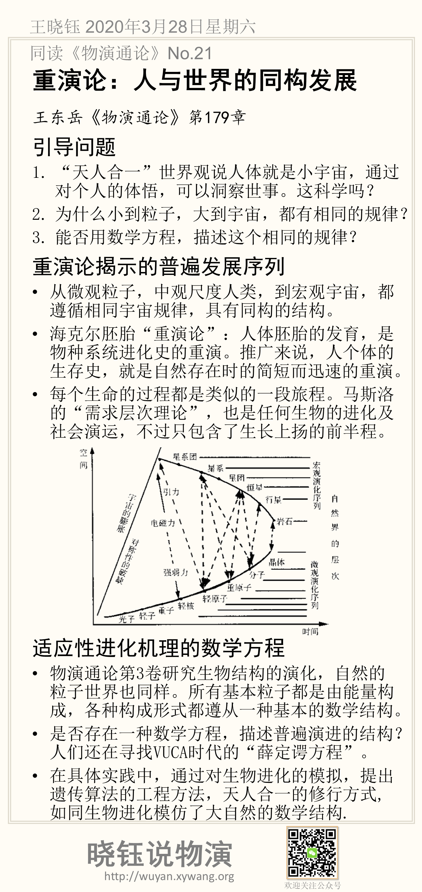

# 重演论：人与世界的同构发展

王东岳《物演通论》第179章

## 引导问题

1. “天人合一”世界观说人体就是小宇宙，通过对个人的体悟，可以洞察世事。这科学吗？

2. 为什么小到粒子，大到宇宙，都有相同的规律？

3. 能否用数学方程，描述这个相同的规律？

## 重演论揭示的普遍发展序列

- 从微观粒子，中观尺度人类，到宏观宇宙，都遵循相同宇宙规律，具有同构的结构。

- 恩斯特·海克尔（E. H. Haeckel）提出胚胎重演论，人体胚胎的发育，就像是整个物种系统进化史的重演。推广来说，人个体的生存史，就像是自然存在的简短而迅速的重演。

- 每个生命的过程都是类似的一段旅程。马斯洛提出“需求层次理论”，人不同成长阶段的需求不同，从“生理需求”，到“安全需要”，“尊重的需要”，到“自我实现的需要”，这个序列，也是任何生物的进化及社会演运（参看第178章）。不过，马斯洛的需求层次理论视野太窄，不仅只是考虑了人，而且只包含了生长上扬的前半程。

## 适应性进化机理的数学方程

- 物演通论第3卷研究生物结构的演化，自然的粒子世界也同样。所有基本粒子都是由能量构成，各种构成形式都遵从一种基本的数学结构。

- 是否存在一种数学方程，描述普遍演进的结构？人们还在寻找VUCA时代的“薛定谔方程”。

- 在具体实践中，通过对生物进化的模拟，提出遗传算法的工程方法，天人合一的修行方式,如同生物进化模仿了大自然的数学结构.

## 参考文献

- 颜泽贤. 系统科学导论：复杂性探索[M].人民出版社, 2006.

## 本节摘要卡片

