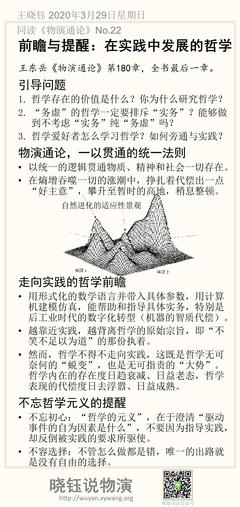

# 前瞻与提醒：在实践中发展的哲学

王东岳《物演通论》第180章，全书最后一章。

## 引导问题

1. 哲学存在的价值是什么？你为什么研究哲学？

2. “务虚”的哲学一定要排斥“实务”？能够做到不考虑“实务”纯“务虚”吗？

3. 哲学爱好者怎么学习哲学？如何旁通与实践？

## 物演通论，一以贯通的统一法则

- 以统一的逻辑贯通物质、精神和社会一切存在。

- 在熵增吞噬一切的涨潮中，挣扎着代偿出一点“好主意”，攀升至暂时的高地，稍息整顿。

## 走向实践的哲学前瞻

- 用形式化的数学语言并带入具体参数，用计算机建模仿真，能帮助和指导具体实务，特别是后工业时代的数字化转型（机器的智质代偿）。

- 越靠近实践，越背离哲学的原始宗旨，即“不笑不足以为道”的那份执着。

- 然而，哲学不得不走向实践，这既是哲学无可奈何的“蜕变”，也是无可指责的“大势”。哲学内在的存在度日趋衰减、日益老态，哲学表现的代偿度日去浮嚣、日益成熟。

## 不忘哲学元义的提醒

- 不忘初心：“哲学的元义”，在于澄清“驱动事件的自为因素是什么”，不要因为指导实践，却反倒被实践的要求所驱使。

- 不容选择：不管怎么做都是错，唯一的出路就是没有自由的选择。

## 本节摘要卡片

