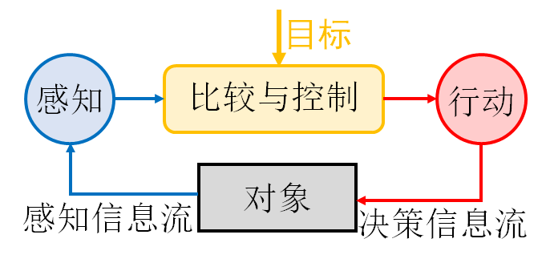
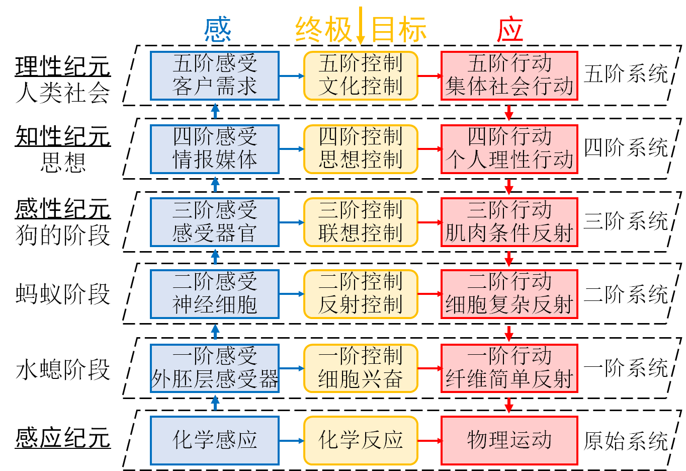
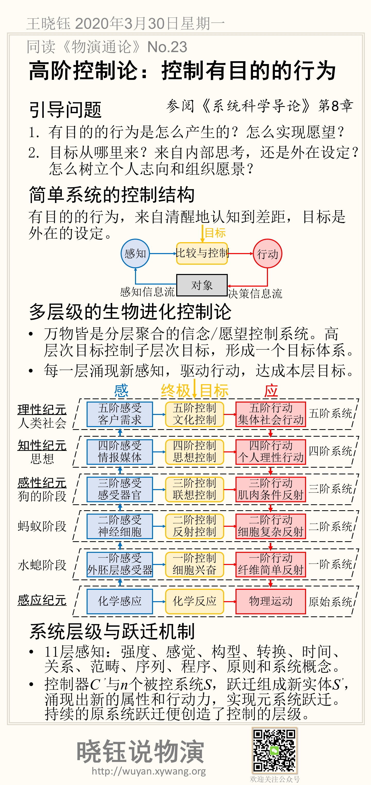

# 高阶控制论：控制有目的的行为

## 引导问题

1. 有目的的行为是怎么产生的？怎么实现愿望？

2. 目标从哪里来？来自内部思考，还是外在设定？怎么树立个人志向和组织愿景？

## 简单系统的控制结构

有目的的行为，来自清醒地认知到差距，目标是外在的设定。

## 多层级的生物进化控制论

- 万物皆是分层聚合的信念/愿望控制系统。高层次目标控制子层次目标，形成一个目标体系。

- 每一层涌现新感知，驱动行动，达成本层目标。

## 系统层级与跃迁机制

- 11层感知：强度、感觉、构型、转换、时间、关系、范畴、序列、程序、原则和系统概念。

- 控制器*C* *’*与*n*个被控系统*S*，跃迁组成新实体*S**’*，涌现出新的属性和行动力，实现元系统跃迁。持续的原系统跃迁便创造了控制的层级。

## 本节摘要卡片

