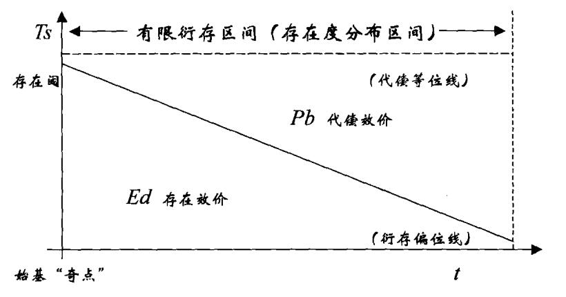
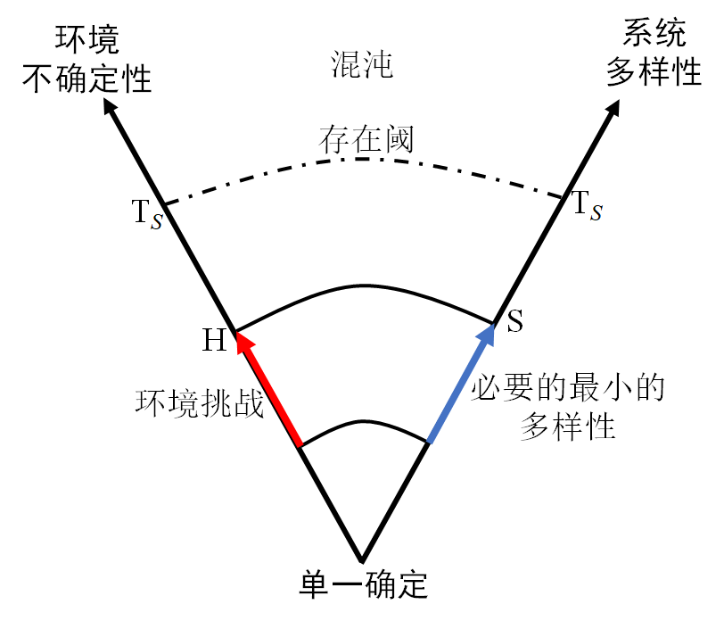

# 递弱代偿原理的另一种表述

《物演通论》用哲学语言力求精准和严谨，而忽视易读性。我认为可以用元科学，把物演通论的思想，换一种更容易理解的方式表述。并借助计算机仿真，能提供丰富的互动，让哲学可视化，即有利于递弱代偿思想的传播，也发展物演通论。

## 引导问题

1. 怎么以符号更形式化地表达递弱代偿原理？
2. 怎么给递弱代偿原理带入参数？怎么定量计算存在度和代偿度？
3. 《物演通论》一书中描述的递弱代偿原理，“稳态解”有哪些前提？

## 递弱代偿原理

《物演通论》以递弱代偿原理为核心，即：

1. 从动向上看，存在效价必趋衰变而代偿效价相应递补，亦即存在效价一般表现为自变递减量，代偿效价一般表现为因变递增量，代偿效价（Pb）是存在效价（Ed）的单向反比线性函数；
2. 从动量上看，代偿效价（Pb）的增量不可能大于存在效价（Ed）的减量，亦即存在阈（Ts）作为一项常量是以上两项具有函数关系的变量之和，由此形成宇宙万物得以存在的基本强度或基准阈值；

写成公式是：
$$
\begin{alignat}{2}

P_b &= \frac{1}{E_d} \tag{1} \\

T_s &= E_d + P_b  \tag{2}

\end{alignat}
$$
图示如下：

图中符号：

$$t$$ ——时间或前时间的衍运维，亦即演动向度之指示；

$$T_s$$——存在阈，亦即演动量度之指示；

$$E_d$$——存在效价或存在度；

$$P_b$$——代偿效价或代偿度；

## 概念的澄清和置换

用系统科学中更精确的概念，置换《物演通论》中描述递弱代偿原理的概念。

### 1. 将“代偿度“，置换为”多样性”

代偿即分化，可以用分化的“复杂度”来代替代偿的概念。不严格地，可以用系统状态的多样性来数量化地计算代偿效价。复杂度和多样性是系统科学语境下的概念。
$$
S=P_b \tag{3}
$$

多样性是指任何系统及其元素存在状态的数目，是系统复杂性的一种度量。多样性包括：

- 系统中元素的种类数量；
- 系统的元素之间的关系紧密程度。

### 2. 将“存在度”，置换为“不确定性”

生物演化过程，就是存在度递失的过程，随着存在度减少，信息量增加，不确定性增加。

用“不确定性”代替存在度的倒数。不确定性即信息熵，表征某随机变量的发生有多么可靠。记作H（X），X是随机变量。当H（X）=0的时候，X是十分确定的，也即X这时就是一个确定的数值。当H（X）=1时，X非常不确定，即X的取值非常不确定是哪一个数值。
$$
H = \frac{1}{E_d} \tag{4}
$$
不确定性的测量，可以根据所有可能的结果，套用概率密度函数来计算。

不确定性的反面，是风险，所以风险等同与存在度。

## 递弱代偿的另一种表述(1)

当将”存在度“换成“不确定性”，将“代偿度”换成“多样性”之后，递弱代偿原理就表达为线性方程，即：
$$
\begin{gather}

S =H \tag{2-1} \\

\begin{split}
S &< T_s, \\
H &<T_S
\end{split} \tag{2-2}

\end{gather}
$$
其中：

H ——不确定性，即信息熵

S ——多样性，即系统及其元素存在的状态的数目

## 递弱代偿的另一种表述(2)

既然新的表述形式是完全线性的，可以旋转坐标系，用一种更直观的方式来描述递弱代偿原理。即：

- 随着环境不确定性增加，系统必须代偿出与之相匹配的多样性（复杂度）

不确定性H的递增，就是熵增定律的拓展，并非东岳先生独创。但是，不确定性的变化，感应出多样性的变化，是先生独到的见解。所以递弱代偿的核心不在递弱，而在代偿。

## 适用于动态过程的递弱代偿

无论是《物演通论》中的表述，还是上述表述，都是递弱代偿的”稳态解“，是“零阶”近似。所以在具体应用中，要注意到社会方程做简化的两点前提假设：

1. 递弱代偿原理是**长时间尺度**的平均，是自然进化中相对稳定态的粗粒度近似。。
2. 递弱代偿原理要在**平均意义**上去理解，是整个讨论尺度内的平均值，在局部和个体是可能存在偏差（上图中小红点），这也是个体局部可能突破社会方程制约，凸显个体主动性的机会。

基于控制论，可以将递弱代偿原理推广到动态过程，用控制框图凸显不确定性的感知信息流，和多样性控制的决策信息流，可以精确表达动态过程的递弱代偿，将哲学思想带入元科学范畴。

## 系统科学：哲学走进科学的桥梁

系统科学，作为一种元科学，对上承接哲学思考，对下升华科学。即有科学的严谨的形式，又有哲学开阔的视角。可以作为物演通论形式化的一个台阶，系统论所提供的概念术语和逻辑结构，可以作为物演通论的一种新形式。

这种形式化的表述，好处是：

- 形式化符号，可以简洁而精确表述；
- 现代化语言，降低理解和传播的难度；
- 可以用计算机模拟，将哲学思想可视化。

我希望系统科学与物演通论的融合，可以使得递弱代偿原理科学化，实用化：

