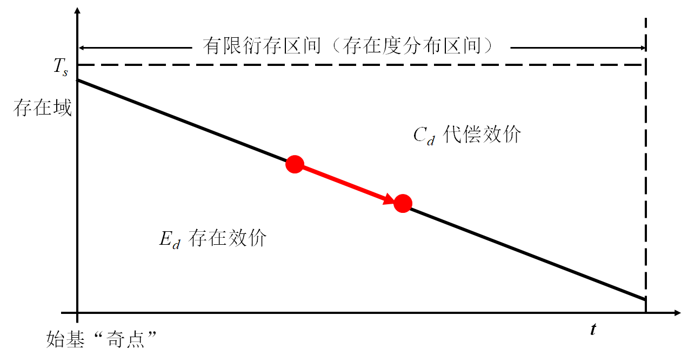
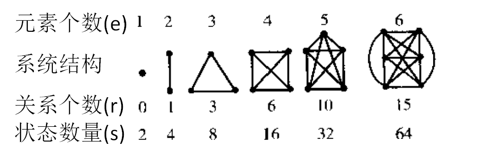
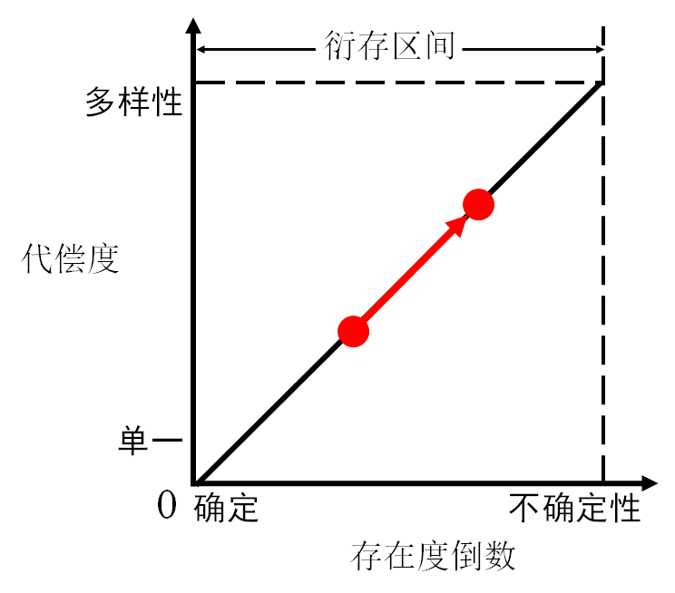
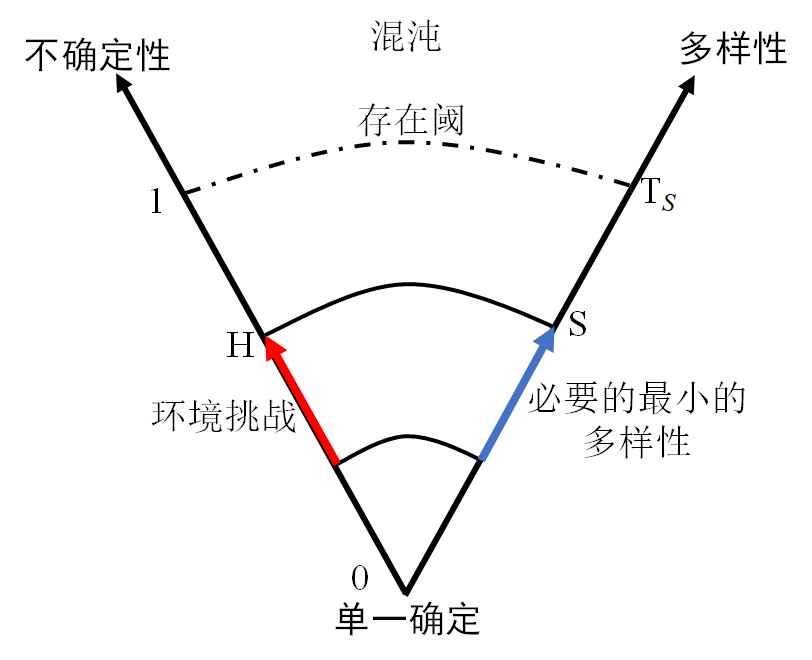
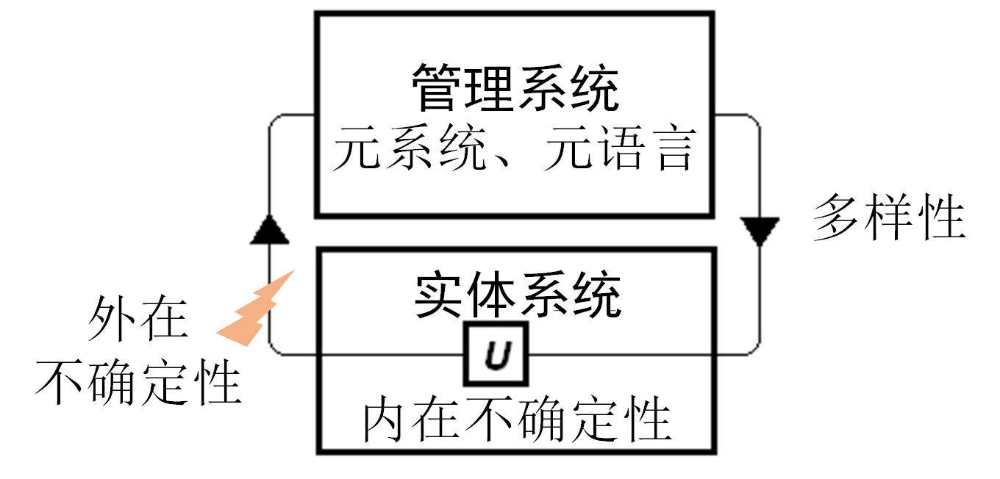

# 递弱代偿原理的另一种表述

> 【摘要】《物演通论》用哲学语言力求精准和严谨，读起来并不容易。我用系统科学的词汇，用”不确定性“和”多样性“置换了”存在度“和”代偿度“，并重新表述了递弱代偿原理。我觉得这样表达物演通论，既不失先生原意，又能用科学语言交流，很容易理解。并且，可以进一步带入参数，并借助计算机仿真，能提供丰富的互动，让哲学可视化，即有利于递弱代偿思想的传播，也发展和推进物演通论，应用与具体实践。

## 引导问题

1. 怎么以科学符号更形式化地表达递弱代偿原理？
2. 怎么给递弱代偿原理带入参数？怎么定量地计算具体问题的存在度和代偿度？
3. 《物演通论》一书中描述的递弱代偿原理，是大尺度的“稳态解”，有哪些前提？

## 递弱代偿原理

《物演通论》以递弱代偿原理为核心，即：

1. 从**动向**上看，存在效价必趋衰变而代偿效价相应递补，亦即存在效价一般表现为**自变递减量**，代偿效价一般表现为**因变递增量**，代偿效价（$$C_d$$）是存在效价（$$E_d$$）的单向反比线性函数；
2. 从**动量**上看，代偿效价（$$C_d$$）的增量不可能大于存在效价（$$E_d$$）的减量，亦即存在阈（$$T_s$$）作为一项**常量**是以上**两项具有函数关系的变量之和**，由此形成宇宙万物得以存在的基本强度或基准阈值；

写成公式是：
$$
\begin{alignat}{2}

C_d &= \frac{1}{E_d} \tag{1} \\

T_s &= E_d + C_d  \tag{2}

\end{alignat}
$$
图示如下：

图中符号：

$$t$$ ——时间或前时间的衍运维，亦即演动向度之指示；

$$T_s$$——存在阈，亦即演动量度之指示；

$$E_d$$——存在效价或存在度；

$$C_d$$——代偿效价或代偿度；

## 概念的澄清和置换

用系统科学中更精确的概念，置换《物演通论》中描述递弱代偿原理的概念。

### 1. 将“代偿度“，置换为”多样性”

代偿即分化，可以用分化的“**复杂度**”来代替代偿的概念。由于复杂度的概念本身还在发展中，不严格地，可以用“多样性”代替复杂性，以系统状态的多样性来数量化地计算代偿效价。

多样性是指任何系统及其元素存在状态的数目，是系统复杂性的一种度量。多样性包括：

- 系统中元素的种类数量；
- 系统的元素之间的关系紧密程度。

复杂度和多样性是系统科学语境下的概念，含义等同于《物演通论》中的代偿度。
$$
S=C_d \tag{3}
$$

### 2. 将“存在度”，置换为“不确定性”

生物演化过程，就是存在度递失的过程，随着存在度减少，信息量增加，不确定性增加。

用“不确定性”代替存在度的倒数。不确定性即信息熵，表征某随机变量的发生有多么可靠。记作$$H(X)$$，其中$$X$$是随机变量。当$$H(X)=0$$的时候，$$X$$是十分确定的，也即$$X$$这时就是一个确定的数值。当$$H(X)=1$$时，$$X$$非常不确定，即$$X$$的取值非常不确定是哪一个数值。
$$
H = \frac{1}{E_d} \tag{4}
$$
不确定性的测量，可以根据所有可能的结果，套用概率密度函数来计算。

不确定性的反面是风险，所以风险等同与存在度。

## 递弱代偿的另一种表述(1)

当将”存在度“换成“不确定性”，将“代偿度”换成“多样性”之后，递弱代偿原理就表达为线性方程，即：
$$
\begin{gather}

S =H \tag{2-1} \\

\begin{split}
S &< T_s, \\
H &<T_S
\end{split} \tag{2-2}

\end{gather}
$$
其中：

$$H$$ ——不确定性，即信息熵

$$S$$ ——多样性，即系统及其元素存在的状态的数目

严格来说，不确定性和多样性的量纲不同，需要一个普适常数做量纲转换。这里暂时忽略这个细节，可认为是将所有变量在各自量纲下先做归一化，数量是标幺值。
$$
S =k \cdot H \tag{2-1.1} \\
$$

## 递弱代偿的另一种表述(2)

既然新的表述形式是完全线性的，可以旋转坐标系，用一种更直观的方式来描述递弱代偿原理。即：

- 随着环境不确定性增加，系统必须代偿出与之相匹配的多样性（复杂度）

这其实很符合常识，左边的不确定性代表问题和挑战，不确定性综合反映了外在的生存压力，和内在的瓦解力量。右边的多样性代表问题的解和应对挑战的手段，多样性综合反映了系统内在的活力和外在的社会支持。

不确定性$$H$$持续递增，系统面临的信息量越来越大，其实就是熵增定律的拓展，是当代科学普遍接受的观念。但是，不确定性的变化，能够感应出多样性的代偿，是东岳先生独到的见解。所以递弱代偿原理的特色不在揭示了“递弱”规律，而在发现了“代偿”规律。

## 递弱代偿的控制论表述(3)

无论是《物演通论》中的表述，还是上述表述，都是递弱代偿的”稳态解“，是“零阶”近似。所以在具体应用中，要注意两点前提假设：

1. 递弱代偿原理是**长时间尺度**的平均，是自然进化中相对稳定态的粗粒度近似。。
2. 递弱代偿原理要在**平均意义**上去理解，是整个讨论尺度内的平均值，在局部和个体是可能存在偏差（上图中小红点），这也是个体局部可能突破社会方程制约，凸显个体主动性的机会。

同时要注意到，递弱代偿原理，是必要条件，而非充分条件，所以表现出对旧有观念强大的解构力，而并不能建构新系统，这才是先生强调他的理论不能直接实用的根本症结所在。

递弱代偿原理虽不能提供具体的解决方案，但是指出了有效解的必要条件，能够否定不成立的解决方案。比如：对于复杂的问题，不可能有简单的解，对于很不确定的挑战，不可能有斩钉截铁的方案。再比如：解决方案必须恰到好处，过度代偿的多样性相当于用力过猛，超过必要的多样性必将反过来作用于自身而产生新的副作用，引发新的不确定性。这实际上是一个闭环反馈的过程，而控制论能比较好地描述这个迭代过程。

基于控制论，可以将递弱代偿原理推广到动态过程，用控制框图凸显不确定性的感知信息流，和多样性控制的决策信息流，可以精确表达动态过程的递弱代偿，将哲学思想带入元科学范畴。

事实上，控制论中的能控性条件，跟递弱代偿原理描述了相似的洞见。控制论奠基人之一艾什比曾在1957年提出**必要的多样性（变异率）定律**，他在《控制论导论》中提出“只有用调节器的多样性，才能压低干扰所引起的多样性，只有用**多样性才能破坏多样性**”。

## 系统科学：哲学走进科学的桥梁

系统科学，作为一种元科学，对上承接哲学思考，对下升华科学。即有科学的严谨的形式，又有哲学开阔的视角。可以作为物演通论形式化的一个台阶，系统论所提供的概念术语和逻辑结构，可以作为物演通论的一种新形式。

这种形式化的表述，好处是：

- 形式化符号，可以简洁而精确表述；
- 现代化语言，降低理解和传播的难度；
- 可以用计算机模拟，将哲学思想可视化。

我希望系统科学与物演通论的融合，可以使得递弱代偿原理科学化，实用化：

