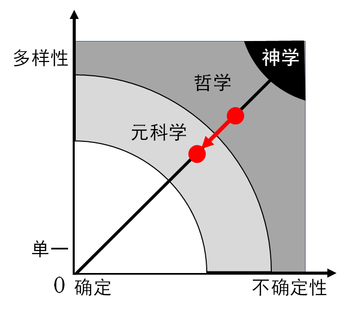

# 递弱代偿原理的另一种表述

> 【摘要】《物演通论》用哲学语言力求精准和严谨，读起来并不容易。我用系统科学的词汇，用”不确定性“和”多样性“置换了”存在度“和”代偿度“，并重新表述了递弱代偿原理。我觉得这样表达物演通论，既不失先生原意，又能用科学语言交流，很容易理解。并且，可以进一步带入参数，并借助计算机仿真，能提供丰富的互动，让哲学可视化，即有利于递弱代偿思想的传播，也发展和推进物演通论，应用与具体实践。

## 引导问题

1. 怎么以科学符号更形式化地表达递弱代偿原理？
2. 怎么给递弱代偿原理带入参数？怎么定量地计算具体问题的存在度和代偿度？
3. 《物演通论》一书中描述的递弱代偿原理，是大尺度的“稳态解”，有哪些前提？

## 高阶动态的递弱代偿原理

更精确的参数化，需要扩展递弱代偿原理的“零阶”近似，补充其“高阶”近似。我曾借鉴

### 1. 存在度递弱的感应定律（递弱代偿原理）

任何封闭系统（包括自然存在、精神存在、社会存在）内部的流通运动，都有保持运动的惯性。流通速度的变化，会感应出阻碍变化的感应动势。

① 感应动势**F**的方向，总要阻碍引起流通运动的变化。（类似电磁学的楞次定律）

② 感应动势**F**的大小，正比于穿过这一系统流通量的变化率。（类似法拉第电磁感应定律）

感应代偿产生的感生动势为如下，称作“感应动力方程”
$$
F=-L \cdot N \cdot \frac {dE} {dt}
$$

感生动势作用在特定系统，会产生结构演化，并产生一定的损耗，方程如下，称作”代偿运动方程“
$$
S=\frac {F}{R}
$$

式中，变量为：

- $$E$$: 系统内的流通量总和
- $$F$$: 系统变革的感应动势
- $$S$$: 系统的结构化度量

参数为：

- $$N$$: 感应耦合系数
- $$L$$: 感应能力系数
- $$R$$: 代偿损耗系数

如果更近一步，就是需要列出两个相对称的原理：

- 存在度递弱的感应定律：

### 2. 代偿度过补的逆感应定律（递弱代偿逆原理）

## 系统科学：哲学走进科学的桥梁

系统科学，作为一种元科学，对上承接哲学思考，对下升华科学。即有科学的严谨的形式，又有哲学开阔的视角。可以作为物演通论形式化的一个台阶，系统论所提供的概念术语和逻辑结构，可以作为物演通论的一种新形式。

这种形式化的表述，好处是：

- 形式化符号，可以简洁而精确表述；
- 现代化语言，降低理解和传播的难度；
- 可以用计算机模拟，将哲学思想可视化。

我希望系统科学与物演通论的融合，可以使得递弱代偿原理科学化，实用化：

